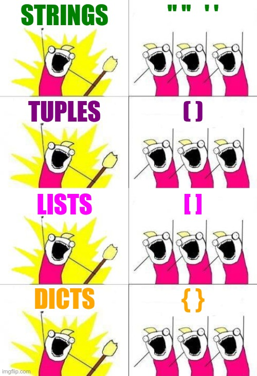

# Chapitre 2: les Tuples
{{initexo(0)}}
{: .center}

{: .center width=30%}


## 1.Définition des tuples
Les tuples (appelés *p-uplets* dans le programme officiel de NSI) sont une collection d'objets **ordonnée** mais **NON MODIFIABLE**.  
Pour rappel :

- **chaine de caractères** : ordonnée et non modifiable
- **liste** : ordonnée et modifiable
- **tuple** : ordonnée et non modifiable 


Quel peut être l'intérêt d'un tuple par rapport à une liste ?

- Justement son caractère protégé : jamais une portion de code ne pourra venir modifier les informations contenues dans le tuple. 
- L'utilisation des tuples est économe en ressources-système par rapport à une liste (en particulier, parce que sa taille est fixe).


```pycon
>>> monPremierTuple = (3, 5, 6)
```

Un tuple se différencie d'une liste par l'utilisation des parenthèses au lieu des crochets.


```pycon
>>> type(monPremierTuple)
tuple
```


À noter qu'un tuple peut être déclaré sans parenthèses. C'est toutefois à éviter.

```pycon
>>> taille = 600, 800
>>> type(taille)
tuple
```

## 2. Accès aux éléments d'un tuple
Comme pour une liste ou une chaîne de caractère, l'accès se fait par un indice entre **crochets**.


```pycon
>>> a = (12, 25, 6)
>>> a[0]
12
```
## 3. Tentative de modification d'un tuple


```pycon
>>> a[0] = 4
    ---------------------------------------------------------------------------
    TypeError                                 Traceback (most recent call last)

    <ipython-input-7-5fe525706b2b> in <module>()
    ----> 1 a[0] = 4
    

    TypeError: 'tuple' object does not support item assignment
```


## 4. Parcours d'un tuple
On retrouve bien évidemment les deux méthodes utilisables pour les listes :

### 4.1 Parcours par indice
```pycon
>>> for k in range(len(a)):
        print(a[k])
12
25
6
```


### 4.1 Parcours par élément


```pycon
>>> for k in a :
        print(k)
12
25
6
```


## 5. Parcours d'une liste de tuples


Il existe deux manières de parcourir une liste de tuples.

### 5.1 Par tuple

Exemple : 
```python
for c in [(-1, 0), (1, 0), (0, -1), (0, 1)]:
    print("Point de coordonnées", c)
```
On récupère ainsi un tuple après l'autre :

```pycon
Point de coordonnées (-1, 0)
Point de coordonnées (1, 0)
Point de coordonnées (0, -1)
Point de coordonnées (0, 1)
```

### 5.2 Par contenu
Exemple : 
```python
for x, y in [(-1, 0), (1, 0), (0, -1), (0, 1)]:
    print("Point d'abscice", x, "et d'ordonnée", y)
```
On récupère ainsi les contenus successifs des tuples :
```pycon
Point d'abscice -1 et d'ordonnée 0
Point d'abscice 1 et d'ordonnée 0
Point d'abscice 0 et d'ordonnée -1
Point d'abscice 0 et d'ordonnée 1
```

## 6. Construction d'une fonction renvoyant un tuple


```python linenums='1'

def division(a, b):
    # fonction renvoyant le tuple (quotient, reste) de la division euclidienne de a par b.
    q = a // b
    r = a % b
    return (q, r)
```


```pycon
>>> division(49,12)
(4,1)
```


!!! example "{{exercice()}}"
    === "Énoncé"
        On considère deux points A et B d'un repère quelconque. Leurs coordonnées sont des tuples à deux éléments.
        Écrire une fonction qui prend en argument les coordonnées de deux points et qui renvoie le milieu de ces deux points.

        La fonction doit fonctionner de cette manière :
        ```pycon
        >>> C = (45, 12)
        >>> D = (49, 32)
        >>> milieu(C,D)
        (47, 22)
        ```
        ```python
        def milieu(point1, point2):
            """
            En entrée: attends les coordonnées de deux points (sous forme de tuples).
            En sortie: renvoie (sous forme de tuple) les coordonnées du point millieu de deux points.
            """
            # votre code
        ```

    === "Correction"
        {{ correction(False,
        "
        ```python linenums='1'
        def milieu(point1, point2):
            abscisse = (point1[0]+point2[0]) / 2
            ordonnee = (point1[1]+point2[1]) / 2
            return (abscisse, ordonnee)
        ```
        "
        ) }}


<!--

def milieu(point1, point2):
    abscisse = (point1[0]+point2[0]) / 2
    ordonnee = (point1[1]+point2[1]) / 2
    return (abscisse, ordonnee)
```

-->


