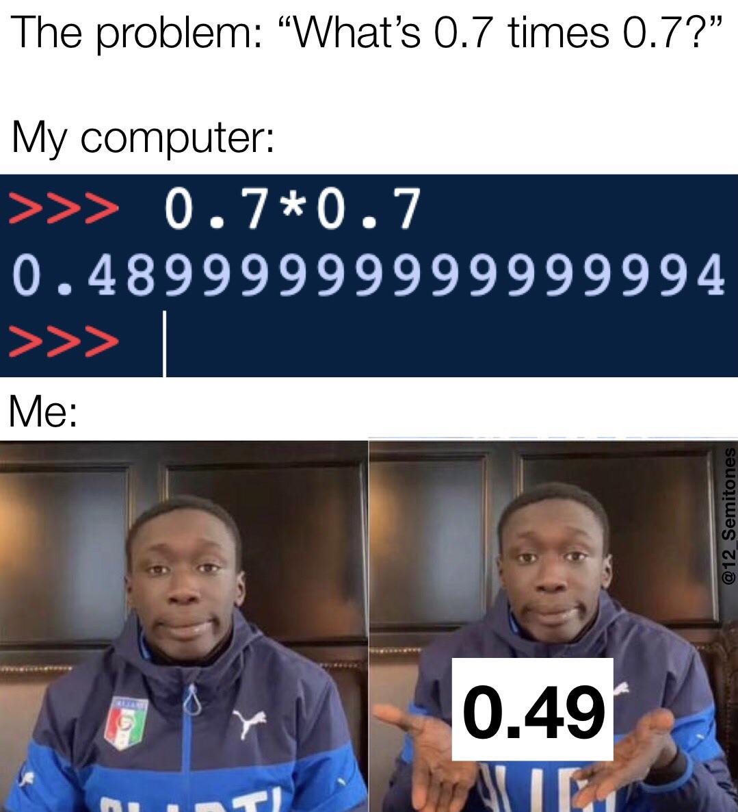

# Chapitre 8 Codage des flottants

{: .center}
{: .center width=40%}


{{ initexo(0) }}

Le principe est l'extension du système déjà rencontré pour les nombres entiers. La partie décimale (à droite de la virgule) correspondra aux puissances négatives de 2.  

|...|8|4|2|1|0.5|0.25|0.125|...|
|:---:|:---:|:---:|:---:|:---:|:---:|:---:|:---:|:---:|
|...|$2^3$|$2^2$|$2^1$|$2^0$|$2^{-1}$|$2^{-2}$|$2^{-3}$|...|
|...|0|1|1|0,|1|0|1|...|

**Exemple :** $110,101_2=1 \times 2^2 + 1 \times2^1 +0 \times 2^0 + 1 \times 2^{-1} +0 \times 2^{-2}+1 \times 2^{-2} =4+2+0,5+0,125=6,625$ 

## 1. Tentatives de conversion 

### 1.1 Théorème de décomposition en puissances de 2
Tout commence bien, avec un résultat mathématique rassurant : **tous** les nombres réels peuvent s'écrire comme une somme de puissances de 2 (puissances positives et négatives). 

!!! abstract "Théorème"
    Pour tout réel $x \in \mathbb{R}^+$, il existe $p \in \mathbb{N}$ et $(a_p,a_{p-1},...,a_0,a_{-1},a_{-2},...)$ tels que $x = \sum_{i=0}^pa_i2^i+\sum_{i=1}^{+\infty}a_{-i}2^{-i}$


Écrire un nombre en binaire revient à calculer les coefficients $a_k$ (ils sont égaux à 0 ou 1). Il y en a un nombre fini pour la partie entière, mais un nombre potentiellement infini pour la partie décimale. 

###  1.2 Méthode de conversion
Considérons le nombre $3,6875$. Il se décompose en une partie entière (3) et une partie décimale ($0,6875$).

- **partie entière :** $3=11_2$ 
- **partie décimale :** la conversion de $0,6875$ se fait en plusieurs étapes.  
$0,6875 \times 2 = \textbf{1},375$  
$0,375 \times 2   = \textbf{0},75$   
$0,75 \times 2 = \textbf{1},5$  
$0,5 \times 2 = \textbf{1}$ 

On prend ensuite le chiffre des unités de tous les nombres obtenus : 1011

Donc $3,6875=11,1011_2$


!!! example "{{ exercice() }}"
    === "Énoncé"
        Donner l'écriture binaire de 20,875.
    === "Correction"{# exo1 #}
        - partie entière : $20 = 10100_2$
        - partie décimale :
            - $0,875 \times 2 = \textbf{1},75$  
            - $0,75 \times 2 = \textbf{1},5$
            - $0,5 \times 2  = \textbf{1}$
 
        Donc $20,875=10100,111_2$ 


!!! example "{{ exercice() }}"
    === "Énoncé"
        Donner l'écriture binaire de 0,2. En déduire que le nombre 0,2 n'admet pas d'écriture binaire **finie**.
    === "Correction" {# exo2 #}
        - partie entière : $0 = 0_2$
        - partie décimale :
            - $0,2 \times 2 = \textbf{0},4$  
            - $0,4 \times 2 = \textbf{0},8$
            - $0,8 \times 2  = \textbf{1},6$
            - $0,6 \times 2  = \textbf{1},2$
            - $0,2 \times 2 = \textbf{0},4$ 
            - *et cela continue...*
 
        Conclusion: Le nombre 0,2 n'admet pas d'écriture binaire **finie**. 


### Conclusion 

Certains nombres n'admettent pas une écriture binaire **finie**. Or la mémoire d'un ordinateur, quelqu'il soit, est toujours finie. Certains nombres ne peuvent donc pas être représentés correctement en machine : c'est une impossibilité théorique. Cela amène à des comportements étranges : 


```python
>>> 0.1 + 0.2
0.30000000000000004
```

**Remarque :** parmi les nombres décimaux à un chiffre après la virgule (0,1  0,2  0,3 ...) seul 0,5 admet une écriture binaire finie ! Tous les autres ont une représentation en machine qui n'en donne qu'une valeur approchée.


## 2. Conséquences : la difficile manipulation des flottants 

En python, les nombres non entiers sont du type **float**. 


```python
>>> type(0.1)
<class 'float'>
```

Ces flottants (traduction française) sont à manipuler avec une extrême précaution. Il faut garder en tête que les calculs sont potentiellement faux, du moins imprécis, lorsque des flottants interviennent.


```python
>>> 0.5-0.2-0.2-0.1
-2.7755575615628914e-17
```
[](){. target="_blank"}

En 1991, durant la Guerre du Golfe, un missile anti-missile américain a raté sa cible de 500 mètres car son ordinateur interne émettait un signal toutes les 0.1 secondes. Au bout de 100 heures de fonctionnement, l'approximation du nombre flottant 0.1 a conduit à un décalage de 0,34 secondes, ce qui lui a fait rater sa cible. ([source](http://www-users.math.umn.edu/~arnold//disasters/patriot.html){. target="_blank"})

## 3. Comment faire des tests d'egalité sur les flottants ? 

Première réponse : ON N'EN FAIT PAS.

Si `a` et `b` sont deux flottants, le test classique

```python
if a == b :
    print("a et b sont égaux")
```

a de grandes chances d'échouer :

Le script 

```python linenums='1'
a = 0.1
b = 0.3 - 0.2
if a == b :
    print("a et b sont égaux")
else :
    print("a et b sont différents")
```

renverra

```
a et b sont différents
``` 


Si *vraiment* un test d'égalité est nécessaire, on ne va pas tester l'égalité entre ```a``` et ```b``` mais leur **proximité**, grâce à la valeur absolue de leur différence.

La fonction `abs(a-b)` renvoie un nombre positif égal à la distance entre `a` et `b`. Il faut alors décider d'un écart minimal `e` en dessous duquel on considèrera que `a` et `b` sont égaux.

Le script 

```python
a = 0.1
b = 0.3-0.2
e = 10**(-12)
if abs(a-b) < e :
    print("a et b sont égaux")
else :
    print("a et b sont différents")
```

renverra
```
a et b sont égaux
``` 

!!! example "{{ exercice() }}"
    === "Énoncé"
        On considère la fonction $f(x)=x^3-6x+2$.   
        L'équation $f(x)=1$ admet une solution unique dans l'intervalle $[0;1]$.  
        Trouver une valeur approchée de cette solution à $10^{-5}$ près. On prendra `e`$=0,001$.
    === "Correction"
        {# exo3 #}
        ```python
        def f(x):
            return x**3 - 6 * x + 2

        e = 10**(-3)
        a = 0
        while abs(f(a) - 1 ) > e :
            a += 10**(-5)
        print(a)
        ```
        

