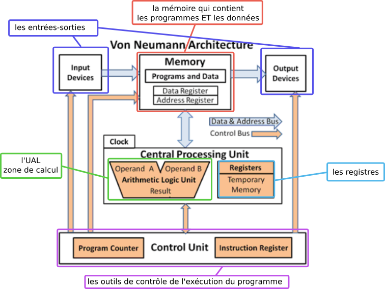
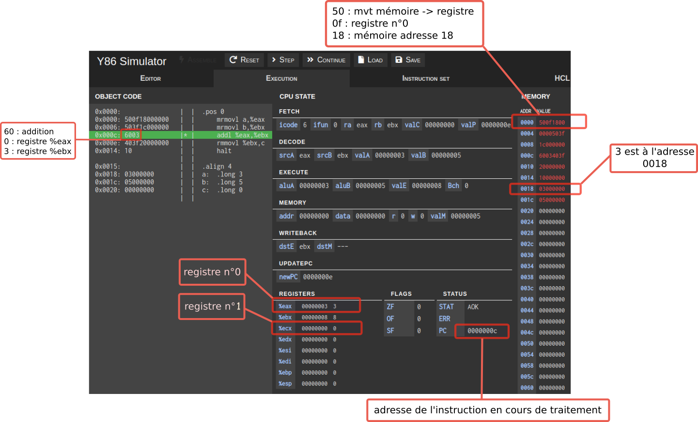
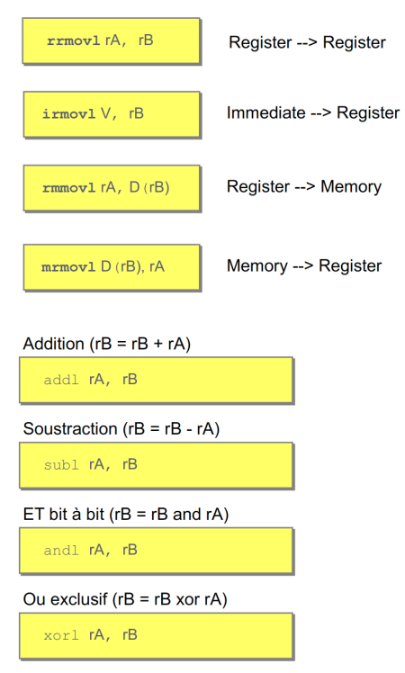
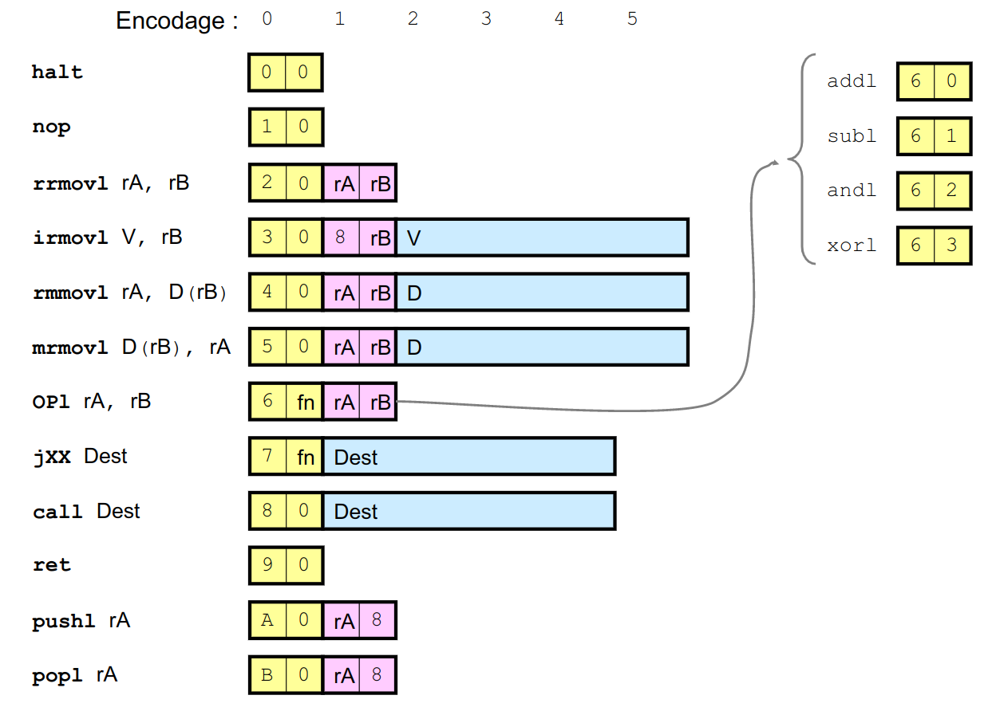

# Chapitre 2: Architecture Von Neumann

{: .center}


{: .center}

*[John Von Neumann](https://fr.wikipedia.org/wiki/John_von_Neumann){. target="_blank"} (1903-1957) est un mathématicien et physicien (et bien d'autres choses) américano-hongrois. Il a le premier théorisé l'architecture des processeurs, tels qu'ils fonctionnent encore aujourd'hui.*

## 1. Architecture von Neumann

{: .center}

On distingue 4 zones essentielles :

- le **CPU** (Central Processing Unit) qui contient lui-même :  
    - l'**Unité Arithmétique et Logique** (UAL) dans laquelle sont effectuées les opérations de base (addition, multiplication...) Cette zone comporte notamment les **registres** (peu nombreux, de l'ordre de la dizaine) qui sont les espaces de travail ultra-rapides dans lesquels l'UAL va effectuer ses calculs. Une fois ceux-ci effectués, les valeurs des registres repartent dans la mémoire.  
    - l'**Unité de contrôle**, qui va séquencer les opérations. Lorsqu'on parle d'un processeur à 3 GHz, cela signifie (approximativement) que Unité de Contrôle va envoyer l'ordre d'une nouvelle opération à l'UAL 3 milliards de fois par seconde.
- la **mémoire**, qui contient **à la fois** les données à traiter **et** les instructions du programme. Cette idée de stocker **au même endroit données et programme** est l'idée centrale de l'architecture von Neumann.
- les **bus** de communication (des fils électriques permettant de transporter les données entre les différents composants).
- les **Entrées/Sorties**, permettant de gérer les informations avec l'extérieur.


## 2. Activité 1 : simulation d'un programme en assembleur

<!-- Cette activité est disponible [ici](https://www.youtube.com/watch?v=5xABe90yolM){. target="_blank"} en vidéo. -->

<!-- <iframe width="933" height="668" src="https://www.youtube.com/embed/5xABe90yolM" title="YouTube video player" frameborder="0" allow="accelerometer; autoplay; clipboard-write; encrypted-media; gyroscope; picture-in-picture" allowfullscreen></iframe> -->

### 2.1 Le programme que nous étudierons


```python
a = 3
b = 5
c = a + b
```

Ce programme est ici écrit en langage Python. Le processeur ne comprend pas ce langage : les instructions doivent lui être passées en langage-machine. C'est le rôle des interpréteurs (pour le Python, par exemple) ou des compilateurs (pour le C, par exemple) que de faire le lien entre le langage pratiqué par les humains (Python, C...) et le langage-machine, qui n'est qu'une succession de chiffres binaires.

Par exemple, notre code ci-dessus s'écrit  

```
01010000 00001111 00011000 00000000
00000000 00000000 01010000 00111111
00011100 00000000 00000000 00000000
01100000 00000011 01000000 00111111
00100000 00000000 00000000 00000000
00000000 00000000 00000000 00000000
00000011 00000000 00000000 00000000
00000101 00000000 00000000 00000000
```


en langage-machine.  
Comment a lieu cette transformation ?

### 2.2 Au plus proche de la machine mais encore humainement compréhensible : le langage assembleur
Il existe un langage dit de "bas-niveau" (au sens qu'il est plus proche du langage machine qu'un langage de haut-niveau comme le Python) qui permet de passer des instructions directement au processeur : c'est le langage assembleur (ou ASM).
 
En assembleur, notre programme s'écrirait (par exemple) :


```
.pos 0
    mrmovl a, %eax
    mrmovl b, %ebx
    addl %eax, %ebx
    rmmovl %ebx, c
    halt

.align 4
a:  .long 3
b:  .long 5
c:  .long 0    
```

- Le [simulateur Y86](https://dept-info.labri.fr/ENSEIGNEMENT/archi/y86js_v2/index.html){. target="_blank"} permet de simuler la manière dont le processeur va exécuter ce programme. 

- Vous pouvez retrouver le programme à charger [ici](data/prog_asm.ys){. target="_blank"}.

{: .center}

#### 2.3.1 Code en langage-machine :
Sur la partie droite du simulateur, la zone Mémoire contient, après assemblage, la traduction de notre code en langage-machine  :
```
500f1800
0000503f
1c000000
6003403f
20000000
00000000
03000000
05000000
```

Une fois transformé en binaire, on retrouve le code donné au début du paragraphe précédent.

??? note "Ressources sur les instructions Y86"
    {: .center width=30%}
    {: .center width=60%}
    


!!! abstract "Exercice"
    === "Énoncé"
        Coder en assembleur la séquence d'instruction suivante :


        ```python
        w = 10
        x = 3
        y = 5
        z = w - (x + y)
        ```

        Vous aurez pour cela besoin de l'instruction `subl rA rB` qui effectue l'opération `rB-rA` et la stocke dans `rB`. (`rA` et `rB` sont les noms des registres).
    === "Correction"
        ```
        .pos 0
        mrmovl x, %eax
        mrmovl y, %ebx
        mrmovl w, %ecx
        addl %eax, %ebx
        subl %ebx, %ecx
        rmmovl %ecx, z
        halt

        .align 4
        w:  .long 10
        x:  .long 3
        y:  .long 5
        z:  .long 0
        ``` 
         


### 2.4 Résumé des notions essentielles 
- Les registres sont à percevoir comme des zones de travail temporaires, à l'accès très rapide. Les données font l'aller-retour entre la mémoire et le registre : elles sont stockées en mémoire, passent dans le registre pour y être modifiées, et reviennent en mémoire.
- les données ET les instructions sont stockées ensemble dans la mémoire : c'est le principe fondateur de l'architecture Von Neumann. Ici, l'octet `03` situé à l'adresse `0x000d` signifie qu'il va falloir ajouter (on le sait grâce au `60` qui précède) le registre numéroté `0` (donc `%eax`) au registre numéroté `3` (donc `%ebx`). On retrouve un octet de même valeur `03` à l'adresse `0x0018`. Mais dans ce cas, cet octet n'est pas une instruction mais une simple donnée : c'est la valeur 3 qu'on a donnée à la variable `a` dans notre programme. 

### 2.5 Conclusion
Le simulateur Y86 nous a permis d'observer comment un processeur réalise des opérations élémentaires. Nous avons découvert le langage assembleur, qui est un langage beaucoup moins agréable qu'un langage de haut-niveau, mais qui reste néanmoins compréhensible par un être humain. Certains informaticiens codent (encore de nos jours) directement en langage assembleur, pour "coller" au mieux au processeur et optimiser les ressources.

## 3. Activité 2 : modification d'un programme par désassemblage

On considère ci-dessous le programme `crackme.c`, rédigé en langage en C. Vous pouvez télécharger ce programme [ici](data/desassemblage/crackme.c).


```c
#include "stdio.h"
#include "stdlib.h"
#include "string.h"

int main()
{

char saisie[50] = "";
printf("Accès restreint : saisissez votre mot de passe \n");
while (strcmp(saisie,"NSI")!=0)
{
printf("Mot de passe ? \n");
scanf("%s",&saisie);
}

printf("Accès autorisé \n");

return 0;
} 
```

- Que fait ce programme ?
- Quel est le mot de passe ?


### 3.1 Compilation et exécution du programme

- Dans un terminal, tapez l'instruction `gcc crackme.c -o crackme`
- Tapez `./crackme` et jouez avec le programme.


### 3.2 Observation du fichier binaire

À l'aide d'un programme (par  exemple [GHex](https://doc.ubuntu-fr.org/ghex){. target="_blank"} sous linux) , il est possible d'aller observer la valeur des octets directement dans le fichier binaire `crackme`.
{: .center}

Ce fichier binaire est écrit en langage-machine. Il est donc incompréhensible pour un autre humain... même si GHex nous aide en affichant notamment (dans la partie droite) les chaînes de caractères... dont notre mot de passe ;)

### 3.3 Modification du fichier binaire
Dans notre code C l'instruction `while (strcmp(saisie,"NSI")!=0)` est le cœur de la vérification du mot de passe. En assembleur, elle va donner naissance à une instruction `JNE` (pour Jump if Not Equal, voir [ici](https://www.gladir.com/LEXIQUE/ASM/jumpif.htm){. target="_blank"} ). Cette instruction est codée en hexadécimal par l'opcode `75 C5`. Nous allons rechercher ces octets et les remplacer par `90 90`, `90` étant l'opcode pour `NOP` (ne rien faire).

- Recherchez `75 C5` dans GHex ou équivalent.
- Remplacez par `90 90`.
- Sauvegardez le fichier sous le nom `crackme2`. Vous pouvez sinon le télécharger [ici](data/desassemblage/crackme2){. target="_blank"} 
- Sous mac ou linux, rendez ce fichier exécutable par `sudo chmod 777 crackme2`
- Exécutez ce code et constatez les changements !

### 3.4 Conclusion
Le désassemblage d'un programme est une opération très complexe et les opérations et chaînes de caractères qui apparaissent sont souvent incompréhensibles (parfois volontairement, dans le cas d'[obfuscation](https://connect.ed-diamond.com/MISC/mischs-007/obfuscation-de-langage-interprete-cachez-ce-code-que-je-ne-saurais-voir){. target="_blank"}  de code).  
Néanmoins, il est parfois possible d'agir au niveau le plus bas (le langage-machine) pour modifier un code, comme nous venons de le faire.


<!-- ??? quote "Bibliographie " -->
<!--     - Numérique et Sciences Informatiques, Terminale, T. BALABONSKI, S. CONCHON, J.-C. FILLIATRE, K. NGUYEN, éditions ELLIPSES. -->
<!--     - Prépabac NSI, Terminale, G.CONNAN, V.PETROV, G.ROZSAVOLGYI, L.SIGNAC, éditions HATIER. -->
<!--     - Cours du DIU-EIL, Architecture matérielle, Raymond Namyst, Université de Bordeaux.  -->

