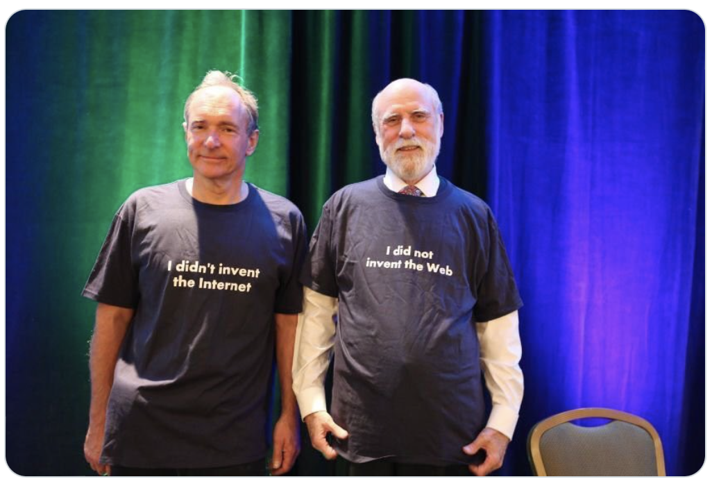
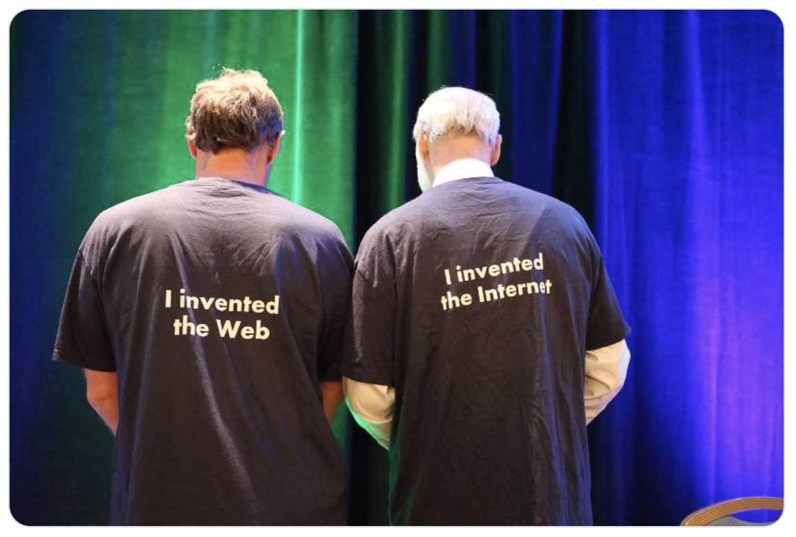
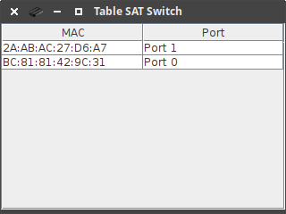
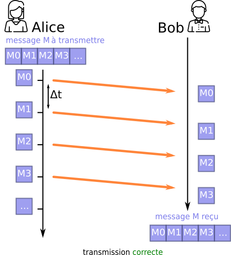
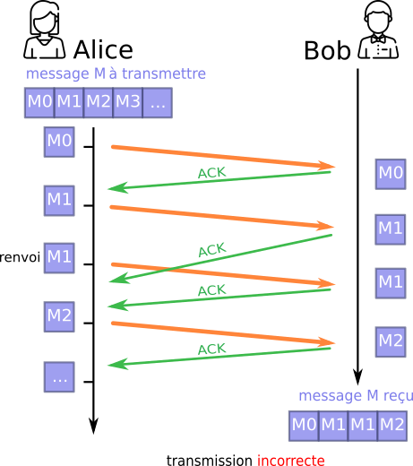
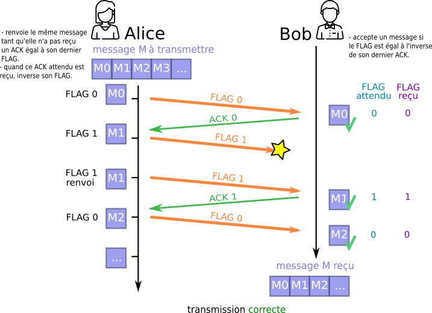
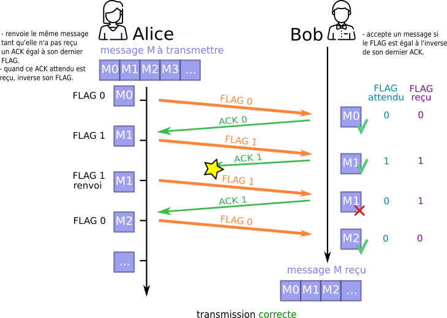
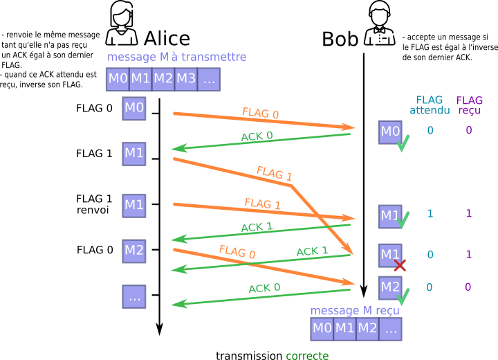

# Chapitre 4: Protocoles de communication dans un réseau

{: .center}

## 1. Les modèles internet en couches


Les bits transmis d'un ordinateur à un autre contiennent, en plus des données _utiles_ (le mot «bonjour» dans un email), une multitude de données (tout aussi utiles) qui vont aider à l'acheminement de ces bits au bon endroit, puis au bon ordinateur, puis au bon logiciel. 
Les différents protocoles qui régissent cette transmission sont regroupés dans ce qui est appelé un **modèle**. Deux modèles synthétisent ces protocoles :

- le **modèle Internet** (ou modèle **TCP/IP**, 1974), organisé en **4** couches : liaison, réseau, transport, application.
- le **modèle OSI** (Open Systems Interconnection, 1984), organisé en **7** couches : physique, liaison, réseau, transport, session, présentation,application.


{: .center width=50%}

Remarque: Ce sont des modèles théoriques et d'une certaine rigidité. Leur utilisation dans la pratique est parfois plus floue, avec des protocoles à cheval sur plusieurs couches.  

Dans la suite de ce cours, nous évoquerons les couches par leur numéro dans le modèle OSI.

Lors de son émission, un message va subir successivement toutes les transformations effectuées par chaque couche, depuis sa création (couche 7) jusqu'à sa transmission physique (couche 1).  

Lorsque ce même message sera réceptionné, les transformations seront effectuées dans l'ordre inverse, jusqu'à la présentation du message au destinataire.


[{: .center width=5%}](data/memeOSI.jpeg){. target="_blank"}


!!! info "La suite des protocoles Internet"
    - C'est l'ensemble des protocoles utilisés pour le transfert des données sur Internet. Elle est aussi appelée suite TCP/IP, d'après le nom de ses deux premiers protocoles : TCP (de l'anglais Transmission Control Protocol) et IP (de l'anglais Internet Protocol). Ils ont été inventés en 1974 par Vinton G. Cerf et Bob Kahn.

{: .center width=50%}


- **couches 7-6-5  — couches application-présentation-session :** 
Ces couches (réunies dans le modèle Internet en une couche unique «application» ) regroupent les protocoles nécessaires à la bonne mise en forme d'un message (au sens large) avant sa transmission. Ces protocoles peuvent être de nature très différente : protocole HTTP pour la transmisson de pages web, protocole FTP pour le transfert de fichiers, protocoles POP ou IMAP pour le courrier électronique...
</br>


!!! info "L'Hypertext Transfer Protocol (HTTP) (Protocole de transfert hypertexte)"
    - Protocole de base qui autorise le transfert de fichiers sur le web, typiquement entre un navigateur web et un serveur HTTP afin que des utilisateurs puissent les consulter. 
    - Le web a été inventé en 1989 par le physicien britannique Tim Berners-Lee, qui travaillait alors au CERN (Organisation européenne pour la recherche nucléaire) en Suisse. Berners-Lee a développé le langage HTML (Hypertext Markup Language) pour créer des pages web et le protocole HTTP (Hypertext Transfer Protocol) pour permettre la transmission de ces pages sur Internet.


{: .center width=50%}

!!! info "File Transfer Protocol (protocole de transfert de fichier), ou FTP"
    - Protocole de communication destiné au partage de fichiers sur un réseau TCP/IP. 


- **couche 4 — couche transport :**   
Le protocole majeur de cette couche est le protocole TCP :
    - il s'assure par SYN-ACK que l'émetteur et le récepteur sont prêts à échanger des messages. 
    - il découpe en segments numérotés le message à transmettre (côté émetteur) ou bien recompose le message total en remettant les segments dans l'ordre (côté récepteur).    
Les éléments échangés avec la couche inférieure sont des **segments**.
</br>

- **couche 3 — couche réseau :**  
Cette couche est la seule à être directement concernée par la topologie du réseau. La couche réseau construit une voie de communication de bout à bout. **Elle utilise les adresses IP (Internet Protocol) pour  identifier les machines sur le réseau internet.** C'est la couche où chaque segment numéroté est encapsulé dans un paquet qui, suivant le protocole IP, va contenir son adresse source et son adresse de destination. **C'est à ce niveau que se décide si le message doit rester dans le réseau local ou être envoyé sur un autre réseau via la passerelle du routeur.** C'est aussi la dernière couche supportée par toutes les machines du réseau pour le transport des données utilisateur : les couches supérieures sont réalisées uniquement dans les machines d'extrémité.  
Les éléments échangés avec la couche inférieure sont des **paquets**.
</br>

!!! info "Internet Protocol (protocole internet), ou IP" 
    - Les protocoles IP assurent l'acheminement des paquets. Ils ne se préoccupent pas du contenu des paquets, mais fournissent une méthode pour les mener à destination. Lorsque deux terminaux communiquent entre eux via ce protocole, aucun chemin pour le transfert des données n'est établi à l'avance : il est dit que le protocole est « non orienté connexion ».
    - En matière de fiabilité, le seul service offert par un protocole IP est de s'assurer que les en-têtes de paquets transmis ne comportent pas d'erreurs grâce à l'utilisation de somme de contrôle (checksum). Si l'en-tête d'un paquet comprend une erreur, sa somme de contrôle ne sera pas valide et le paquet sera détruit sans être transmis. 
    - Les garanties non offertes par un protocole IP (corruption de données, ordre d'arrivée des paquets, perte ou destruction de paquets, duplication des paquets) sont déléguées aux protocoles de niveau supérieur. La raison principale de cette absence de gestion de la fiabilité est la volonté de réduire le niveau de complexité des routeurs et ainsi de leur permettre de disposer d'une plus grande rapidité. L'intelligence est alors déportée vers les points d'extrémité du réseau.


!!! info "Internet Control Message Protocol (Protocole de message de contrôle sur Internet), ou ICMP"
    - L’un des protocoles fondamentaux constituant la suite des protocoles Internet. C'est un protocole de couche réseau (couche n° 3 du modèle OSI), au même niveau que le protocole Internet (IP). Le protocole IP ne gérant que le transport des paquets et ne permettant pas l'envoi de messages d'erreur, on lui associe ICMP pour contrôler les erreurs de transmission. ICMP permet de transporter des messages de contrôle et d’erreur pour qu'une machine émettrice sache qu'il y a eu un incident de réseau, par exemple lorsqu’un service ou un hôte est inaccessible. La commande `Ping` est un exemple d'application utilisant des messages de contrôle ICMP.

- **couche 2 — couche liaison :**  
Les adresses MAC sont utilisées pour relier les machines au réseau d'où le nom de couche liaison. Suivant le protocole de la couche 1 (Ethernet, wifi ou autre), les informations sont transmises d'une carte réseau à une autre, grâce à leur adresse MAC (Media Access Controler).  
Les éléments échangés avec la couche inférieure sont des **trames**.  
C'est l'encapsulation finale du message. 
</br>

- **couche 1 — couche physique :**  
C'est la couche où le message est transmis physiquement d'un point à un autre. Par signal lumineux (fibre optique), par ondes (wifi), par courant électrique (Ethernet)... Les éléments transmis sont les **bits**. 

 


Lors de son parcours, une trame peut être partiellement décapsulée et remonter à la couche 3, avant de redescendre et de continuer son chemin. C'est le cas notamment lors du passage dans un routeur. Mais jamais, lors de son acheminement, le contenu réel du message n'est ouvert : les paquets transmis sont acheminés de manière identique, qu'ils contiennent les éléments constitutifs d'une vidéo YouTube ou d'un email à votre cousin.  


Ce principe fondateur, actuellement menacé par certains acteurs politiques et industriels, est connu sous l'expression **«la neutralité du net»**.


## 2. Observation des trames avec Filius

### 2.1. Ping à travers un switch
Vous pouvez télécharger le fichier [ping_switch.fls](data/ping_switch.fls).

- Relions une machine ```192.168.0.10``` d'adresse MAC ```BC:81:81:42:9C:31```  à une machine ```192.168.0.11``` d'adresse MAC ```2A:AB:AC:27:D6:A7``` à travers un switch.  
 
{: .center} 

- Observons la table SAT de notre switch : elle est vide, car aucune machine n'a encore cherché à communiquer.  

{: .center} 

- Lançons un ping depuis ```192.168.0.10``` vers ```192.168.0.11``` et observons les données échangées :   

{: .center}  

- Observons de plus près la première ligne de données échangées.  

{: .center}   

Cette première ligne est une requête **ARP**. ARP est un protocole qui s'interface entre la couche 3 / réseau (appelée dans la capture d'écran _Internet_)  et la couche 2 / liaison (appelée dans la capture d'écran _Réseau_). Comme indiqué dans le commentaire, elle consiste à un appel à tout le réseau : "Est-ce que quelqu'un ici possède l'IP ```192.168.0.11``` ?

!!! info "Protocole de résolution d'adresse (en anglais Address Resolution Protocol)."
    - Le protocole ARP a un rôle phare parmi les protocoles de la couche Internet de la suite TCP/IP, car il permet de connaître l'adresse physique d'une carte réseau correspondant à une adresse IP, c'est pour cela qu'il s'appelle Protocole de résolution d'adresse (en anglais ARP signifie Address Resolution Protocol).


**Message 1 : « Qui possède l'IP ```192.168.0.11``` ? »**

Il faut comprendre à cette étape que l'adresse IP est totalement inutile pour répérer un ordinateur dans un sous-réseau. Ce sont les adresses MAC qui permettent de se repérer dans un sous-réseau. Les adresses IP, elles, permettront éventuellement d'acheminer le message jusqu'au bon sous-réseau (elles n'intéressent donc que les routeurs).


Revenons à notre ping vers ```192.168.0.11```.

La commande ```arp -a``` effectuée dans un terminal de la machine ```192.168.0.10``` nous permet de voir qu'elle ne connaît encore personne dans son sous-réseau. La table de correspondance IP ⮀ MAC ne contient que l'adresse de broadcast ```255.255.255.255```, qui permet d'envoyer un message à tout le réseau.  
{: .center} 

Constatant qu'elle ne sait pas quelle est l'adresse MAC de ```192.168.0.11```, la machine ```192.168.0.10``` commence donc par envoyer un message à **tout** le sous-réseau, par l'adresse MAC de broadcast ```FF:FF:FF:FF:FF:FF```. Le switch va lui aussi lui aussi relayer ce message à tous les équipements qui lui sont connectés (dans notre cas, un seul ordinateur) 


**Message 2 : « Moi ! »**  

La machine ```192.168.0.11``` s'est reconnu dans le message de broadcast de la machine ```192.168.0.10```. Elle lui répond pour lui donner son adresse MAC.  

{: .center} 

À partir de ce moment, la machine ```192.168.0.10``` sait comment communiquer avec ```192.168.0.11```. Elle l'écrit dans sa table ```arp```, afin de ne plus avoir à émettre le message n°1 :  

{: .center} 


Le switch, qui a vu passer sur ses ports 0 et 1 des messages venant des cartes MAC ```BC:81:81:42:9C:31```  et ```2A:AB:AC:27:D6:A7```, peut mettre à jour sa table SAT :  

{: .center} 

Par la suite, il saura sur quel port rediriger les messages destinés à ces deux adresses MAC. Un switch est un équipement de réseau de la couche 2 du modèle OSI, il ne sait pas lire les adresses IP : il ne travaille qu'avec les adresses MAC.

**Message 3 : le ping est envoyé**

{: .center} 

Schématisons cette trame Ethernet (couche 2 du modèle OSI) :

{: .center} 

**Message 4 : le pong est retourné**

{: .center} 


{: .center} 


### 2.2. Ping à travers un routeur

Vous pouvez télécharger le fichier [ping_routeur.fls](data/ping_routeur.fls).

{: .center} 

L'objectif est d'observer les différentes trames lors d'un ping entre :

- la machine ```192.168.0.1 / 24``` (adresse MAC ```F9:E1:D6:0B:29:03``` ) et
- la machine ```192.168.1.1 / 24``` (adresse MAC ```D3:79:96:B8:5C:A4``` )

Le routeur est configuré ainsi :

- interface sur le réseau A :
    - IP : ```192.168.0.254``` 
    - MAC : ```77:C2:22:C9:5C:E7``` 
- interface sur le réseau B :
    - IP : ```192.168.1.254``` 
    - MAC : ```66:E5:4E:7D:0B:B0``` 


**Étape 0 : le routeur signale sa présence**

Lors de l'observation des messages reçus ou émis par la machine ```192.168.0.1```, on peut être intrigué par ce tout premier message reçu, émis par le routeur : 

{: .center} 

On peut y distinguer les 4 couches du modèle Internet. Le routeur, par ce message distribué à tous les éléments du sous-réseau A (il envoie un message équivalent sur son sous-réseau B), déclare sa présence, et le fait qu'il possède deux interfaces, une pour chaque réseau. 
Il se positionne ainsi comme une passerelle : «c'est par moi qu'il faudra passer si vous voulez sortir de votre sous-réseau». 
Dans cette trame envoyée figure son adresse MAC, de sorte que tous les membres de son sous-réseau pourront donc communiquer avec lui.


**Étape 1 : de ```192.168.0.1``` vers le routeur**

La machine ```192.168.0.1 / 24``` calcule que la machine ```192.168.1.1 / 24``` avec laquelle elle veut communiquer n'est **pas** dans son sous-réseau.
Elle va donc envoyer son message à sa passerelle, qui est l'adresse du routeur dans son sous-réseau. 

Cette première trame est :

{: .center} 


**Étape 2 : le routeur décapsule la trame**

Le routeur est un équipement de réseau de couche 3 (couche réseau). Il doit observer le contenu du paquet IP (sans remonter jusqu'au contenu du message) pour savoir, suivant le procédé de **routage** (voir cours de Terminale), où acheminer ce paquet.

Dans notre cas, l'adresse IP ```192.168.1.1```de destination lui est accessible : elle fait partie de son sous-réseau B.

Le routeur va modifier la valeur du TTL (Time To Live), en la décrémentant de 1. Si, après de multiples routages, cette valeur devenait égale à 0, ce paquet serait détruit. Ceci a pour but d'éviter l'encombrement des réseaux avec des paquets ne trouvant pas leur destination.

??? note "NAT : translation d'adresse"
    Dans notre cas, le routeur va laisser intacte l'adresse IP Source. Ce n'est pas toujours le cas. Dans le cas classique de la box qui relie votre domicile à internet, le routeur contenu dans celle-ci va remplacer l'adresse locale de votre ordinateur ou smartphone (ex ```192.168.0.26```) par son IP publique (celle apparaissant sur [whatsmyip.com](http://whatsmyip.com), par exemple). Elle effectue ce qu'on appelle une translation d'adresse (NAT). 
    Pourquoi ? Parce que sinon la réponse du serveur distant que vous interrogez serait envoyée sur une adresse locale (votre adresse ```192.168.0.26```), qui est introuvable depuis un réseau extérieur. Il faut donc remplacer toutes les adresses locales par l'IP publique de votre box.
    Pour éviter que la réponse du serveur web que vous avez interrogé ne soit affichée sur l'ordinateur de vos parents, le routeur affecte des ports différents à chaque machine de son sous-réseau. Ce port est inclus dans le message transmis au serveur, et il l'est aussi dans sa réponse : le routeur peut donc rediriger le trafic vers la bonne machine du sous-réseau.

Le routeur va ré-encapsuler le paquet IP modifié, et créer une nouvelle trame Ethernet en modifiant :

- l'adresse MAC source : il va mettre l'adresse MAC de son interface dans le sous-réseau B.
- l'adresse MAC de destination : il va mettre l'adresse MAC de ```192.168.1.1 ``` (qu'il aura peut-être récupérée au préalable par le protocole ARP)

Cette deuxième trame est donc :

{: .center} 

On peut observer dans Filius cette trame, en se positionnant sur l'interface ```192.168.1.254 ``` du routeur, ou sur ```192.168.1.1 ``` :

{: .center} 


En suivant le même principe, la machine ```192.168.1.1 ``` pourra envoyer son _pong_.


### 2.3. Exercice

!!! note "Exercice de bac"
    === "Énoncé"
        Parties 2 et 3 de l'exercice 2 du sujet [Nouvelle-Calédonie J1 2022](https://raoulhatterer.github.io/tnsi/T6_Annales/data/2022/2022_Nouvelle-Caledonie_J1.pdf){. target="_blank"}.
    
    === "Correction"
        **Partie 2**
        ??? tip "Correction Q1."
            Le réseau services a pour adresse IP ```195.168.254.0```.

        ??? tip "Correction Q2."
            Le réseau services a pour adresse ```195.168.254.0```. Comme le masque de sous-réseau utilisé est ```255.255.255.0```, 254 adresses sont initialement disponibles (```195.168.254.1```  à ```195.168.254.254```, puisque l'adresse ```195.168.254.255``` est réservée pour le *broadcast* sur le réseau). Comme deux adresses sont déjà prises par le routeur 1 et le routeur 2, il en reste 252.

        ??? tip "Correction Q3."
            Le serveur web accède à internet via le routeur 2, dont l'adresse sur le réseau services est ```192.168.254.2```. C'est donc cette adresse qui joue est l'adresse de passerelle pour le serveur web.

        **Partie 3**
        ??? tip "Correction Q1."
            La ligne 2 montre que l'adresse MAC du serveur DNS est ```8A:FD:54:49:D0:CC```. 

        ??? tip "Correction Q2."
            La couche Transport montre que le protocole utilisé est le protocole UDP.

        ??? tip "Correction Q3."
            Le commentaire de la couche Application indique que l'adresse IP du serveur web est ```192.168.254.201```. 


## 3. Protocole du bit alterné

Ce protocole est un exemple simple de fiabilisation du transfert de données. 

### 1. Contexte

- Alice veut envoyer à Bob un message M, qu'elle a prédécoupé en sous-messages M0, M1, M2,...
- Alice envoie ses sous-messages à une cadence Δt fixée

Remarque: en pratique, les sous-messages partent quand leur acquittement a été reçu ou qu'on a attendu celui-ci trop longtemps (on parle alors de _timeout_).

### 2. Situation idéale

{: .center} 

Dans cette situation, les sous-messages arrivent tous à destination dans le bon ordre. La transmission est correcte.

### 3. Situation réelle
Mais parfois, les choses ne se passent pas toujours aussi bien. Car si on maîtrise parfaitement le timing de l'envoi des sous-messages d'Alice, on ne sait pas combien de temps vont mettre ces sous-messages pour arriver, ni même (attention je vais passer dans un tunnel) s'ils ne vont pas être détruits en route.

{: .center} 

Le sous-message M0 est arrivé après le M1, le message M2 n'est jamais arrivé...

Que faire ?

Écartons l'idée de numéroter les sous-messages, afin que Bob puisse remettre dans l'ordre les messages arrivés, ou même redemander spécifiquement des sous-messages perdus. C'est ce que réalise le protocole TCP (couche 4 — transport), c'est très efficace, mais cher en ressources. Essayons de trouver une solution plus basique.

### 3. Solution naïve...

Pourquoi ne pas demander à Bob d'envoyer un signal pour dire à Alice qu'il vient bien de recevoir son sous-message ?
Nous appellerons ce signal ACK (comme _acknowledgement_, traduisible par «accusé de réception»).
Ce signal ACK permettra à Alice de renvoyer un message qu'elle considérera comme perdu :

{: .center} 

N'ayant pas reçu le ACK consécutif à son message M1, Alice suppose (avec raison) que ce message n'est pas parvenu jusqu'à Bob, et donc renvoie le message M1.

### 4. Mais peu efficace...

{: .center} 

Le deuxième ACK de Bob a mis trop de temps pour arriver (ou s'est perdu en route) et donc Alice a supposé que son sous-message M1 n'était pas arrivé. Elle l'a donc renvoyé, et Bob se retrouve avec deux fois le sous-message M1. La transmission est incorrecte. 
En faisant transiter un message entre Bob et Alice, nous multiplions par 2 la probabilité que des problèmes techniques de transmission interviennent. Et pour l'instant rien ne nous permet de les détecter.

### 5. Bob prend le contrôle

Bob va maintenant intégrer une méthode de validation du sous-message reçu. Il pourra décider de le garder ou de l'écarter. Le but est d'éviter les doublons.

Pour réaliser ceci, Alice va rajouter à chacun de ses sous-messages un bit de contrôle, que nous appelerons FLAG (drapeau). Au départ, ce FLAG vaut 0. 
Quand Bob reçoit un FLAG, il renvoie un ACK **égal au FLAG reçu**.

Alice va attendre ce ACK contenant le même bit que son dernier FLAG envoyé :

- tant qu'elle ne l'aura pas reçu, elle continuera à envoyer **le même sous-message, avec le même FLAG**.
- dès qu'elle l'a reçu, elle peut envoyer un nouveau sous-message en **inversant** («alternant») **le bit de son dernier FLAG** (d'où le nom de ce protocole).


Bob, de son côté, va contrôler la validité de ce qu'il reçoit : il ne gardera que **les sous-messages dont le FLAG est égal à l'inverse de son dernier ACK**. C'est cette méthode qui lui permettra d'écarter les doublons.

Observons ce protocole dans plusieurs cas :

##### 5.1 Cas où le sous-message est perdu

{: .center} 


##### 5.2 Cas où le ACK  est perdu
{: .center} 

Le protocole a bien détecté le doublon du sous-message M1.

##### 5.3 Cas où un sous-message est en retard

{: .center} 

Le protocole a bien détecté le doublon du sous-message M1... mais que se passerait-il si notre premier sous-message M1 était _encore plus_ en retard ?


### 6. Conclusion
Le protocole du bit alterné a longtemps été utilisé au sein de la couche 2 du modèle OSI (distribution des trames Ethernet). Simple et léger, il peut toutefois être facilement mis en défaut, ce qui explique qu'il ait été remplacé par des protocoles plus performants.


<!-- [correction du DS](data/DS_routage_1NSI_corr.pdf)
 -->


</br>

