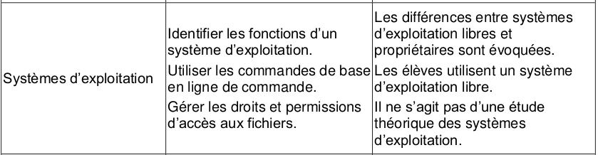
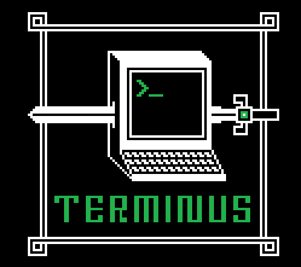

# Chapitre 5: Découverte des commandes UNIX

{: .center}

Vous allez découvrir les principales commandes Linux à partir du jeu Terminus

{: .center width=30%}

Pour cela, rendez-vous à l'adresse [http://luffah.xyz/bidules/Terminus/](http://luffah.xyz/bidules/Terminus/) et laissez vous guider par le jeu. Mais attention toutefois à respecter les consignes ci-dessous:

1. Vous **devez noter sur un papier** chaque nouvelle commande que vous apprenez (ces commandes seront à apprendre par cœur). Vous pouvez par exemple construire un tableau de ce type :
   {: .center}

2. Vous devez établir un plan du jeu **au fur et à mesure** que vous avancez dans votre quête. Par exemple :
   {: .center}

<!--
## Correction
Voici [un corrigé](data/Terminus-corrige.pdf) établi par Charles Poulmaire, de l'académie de Versailles.
-->
