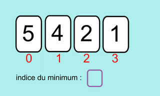

# Vers le tri par sélection

{: .center}


Comme dans tous les autres algorithmes de tri que nous allons étudier, nous allons travailler **en place**. Cela signifie que nous ne travaillons que sur la liste initiale, sans en créer de nouvelles. Le tri sera fait en permutant des éléments.


- on cherche le minimum de toute la liste, et on le place au tout début de la liste.
- on cherche maintenant le minimum de toute la liste SAUF le 1er terme, et on le place en 2ème position.
- on continue ainsi jusqu'à la fin.


??? note "Code à trous :star: :star: :star: :star:" 
    ```python
    def tri_selection(lst) :
        ...
    ```


??? note "Code à trous :star: :star: :star: :octicons-star-24: " 
    ```python
    def tri_selection(lst) :
        for ... in ... :
            ... = ...
            for ... in ... :
                if ... :
                    ...
            ...
    ```

??? note "Code à trous :star: :star: :octicons-star-24: :octicons-star-24:"
    ```python
    def tri_selection(lst) :
        for i in range(...):
            ... = i
            for k in range(..., ...) :
                if ... < ... :
                    ... = ...
            ..., ... = ..., ...
    ```


??? note "Code à trous :star: :octicons-star-24: :octicons-star-24: :octicons-star-24:"
    ```python
    def tri_selection(lst) :
        for i in range(len(lst)-1):
            indice_min = ...
            for k in range(..., len(lst)) :
                if lst[...] < lst[...]:
                    indice_min = ...
            lst[...], lst[...] = lst[...], lst[...]
    ```
        


