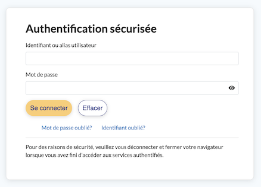

# Chapitre 1: Pages web et interactions

{: .center}


{: .center}


## 1. Le cas le plus simple : la même page pour tout le monde

{: .center}

Nous allons tout d'abord considérer le cas où le serveur renvoie une page unique, identique pour tous les utilisateurs. De plus, l'utilisateur ne pourra pas agir sur sa page : il n'y a aucune interactivité. On parle de page statique.

Exemple de page statique côté serveur et côté utilisateur :

- cette [merveille](./interesting.html){:target="_blank"} de page web.
- plus complète, mais tout aussi statique : cette page [Wikipedia](https://fr.wikipedia.org/wiki/Leslie_Lamport){:target="_blank"} consacrée à Leslie Lamport.

### 1.1 ```html```  pur

Lorsque le client demande au serveur le contenu d'une page web, celui-ci lui renvoie, dans le cas le plus simple, une simple page ```html```.  
```html``` est un langage dit « à balises ».  Ce n'est pas à proprement parler un langage de programmation, mais plutôt un **langage de description** de contenu. 
Il a été inventé en 1992 par [Tim Berners-Lee](https://fr.wikipedia.org/wiki/Tim_Berners-Lee){:target="_blank"}. La version actuellement utilisée est le ```html5```.


!!! abstract "Exemple de page web minimale"
    ```html
    <!DOCTYPE html>
    <html lang='fr'>
      <head>
        <meta charset="utf-8">
        <title>Un titre très original</title>
      </head>
    
      <body>
        <p>Ceci est le texte introductif de ma page.</p>
        <h1>  Ceci est un titre de niveau 1 </h1>
        Mais sans rien d'intéressant.
        <h2>  Ceci est un titre de niveau 2 </h2>
        <ul>
          <li> le début d'une liste indentée </li>
          <li> la suite ... </li>
        </ul>  
        <p>
          Pour apprendre le fonctionnement des balises, voir <a href="https://developer.mozilla.org/fr/docs/Apprendre/HTML/Introduction_%C3%A0_HTML/Getting_started"> ici</a> par exemple !
        </p>
      </body>
    </html>
    
    ```

Allez contempler [ici](./web_minimale.html){:target="_blank"} le rendu de cette magnifique page et **suivez le lien qui s'y trouve pour apprendre le fonctionnement des balises html**.

{{ initexo(0)}}
!!! example "{{ exercice() }}"
    === "Énoncé"
      - Créez un dossier contenant un fichier ```mapage.html```.
      - Créez une page contenant une image et un lien vers le site du lycée.
      - Vous pouvez utiliser l'éditeur de votre choix. Par exemple le logiciel _Sublime Text_  installé au lycée (pour le lancer cliquez sur l'icône Windows puis commencez à taper _Sublime_ au clavier) que vous pouvez aussi [installer](https://www.sublimetext.com){:target="_blank"} sur votre ordinateur personnel.
      - Vous pouvez aussi utiliser un éditeur en ligne avec rendu instantané, du type [https://www.w3schools.com/tryit/](https://www.w3schools.com/tryit/){:target="_blank"}
       
#### Pour conclure

!!! done "À retenir"

    - Pour créer une page web, on crée un fichier ayant l'extension  `.html`  , qui pourra être ouvert dans le navigateur web simplement en faisant un double-clic dessus.
    - Chaque fichier HTML est constitué de balises.
    - Les balises peuvent avoir plusieurs formes :
        - `<balise> </balise>`  : **balises en paires**, elles s'ouvrent et se ferment pour délimiter le contenu (début et fin d'un titre, par exemple) ;
        - `<balise>`  : **balises orphelines** (on ne les insère qu'en un seul exemplaire), elles permettent d'insérer un élément à un endroit précis (par exemple une image).
    - Les balises sont parfois accompagnées d'attributs pour donner des indications supplémentaires, ou paramétrer un élément (exemple :  ``  ).
    - Une page web est constituée de deux sections principales : l'en-tête`<head> </head>`  dont le contenu n'apparaît pas dans l'affichage de la page et le corps `<body> </body>`  qui, lui, apparaît.

#### En savoir plus

- [le cours d'OpenClassrooms](https://openclassrooms.com/fr/courses/1603881-apprenez-a-creer-votre-site-web-avec-html5-et-css3){:target="_blank"} (l'inscription est gratuite)
- Le cours interactif sur le HTML [du site w3schools](https://www.w3schools.com/html/){:target="_blank"}


###  Aide mémoire HTML

??? done "Si vous avez besoin de retrouver facilement une balise html"
    Vous pouvez télécharger et consulter 
    [la liste des balises html](./data/Glossaire+des+balises+HTML.pdf){:target="_blank"} de [Mathieu Nebra](https://fr.wikipedia.org/wiki/Mathieu_Nebra){:target="_blank"}.
    

#### Quiz

- [Maîtriser les bases de HTML5](https://openclassrooms.com/fr/courses/1603881-creez-votre-sitee-web-avec-html5-et-css3/exercises/4740){:target="_blank"}


### 1.2 ```html``` + ```css``` 

L'acronyme ```css```  signifie _Cascading Style Sheets_ (feuilles de style en cascade). L'idée est de regrouper dans un seul fichier toutes les informations relatives à la mise en forme des éléments de la page html. 
De manière très simplifiée, on peut dire que le fichier ```html``` s'occupe _du fond_ tandis que le fichier ```css``` s'occupe de la _forme_.

Le fichier ```css``` (souvent nommé ```style.css```) doit être référencé au début du fichier ```html``` , au sein de la balise ```<head>```.


!!! abstract "Exemple de couple ```html``` / ```css``` minimal"

    - fichier ```index.html``` : 
    ```html
    <!DOCTYPE html>
    <html>
      <head>
        <meta charset="utf-8">
        <title>page test</title>
        <link href="style.css" rel="stylesheet" type="text/css" />
      </head>
        <body>
              <h1>  Ceci est un titre de niveau 1 </h1>
              Mais sans rien d'intéressant.
              <h2>  Ceci est un titre de niveau 2 </h2>
        </body>
    </html>
    ```

    - fichier ```style.css``` :

    ```css
    html {
        font-size: 15px;
        font-family:  sans-serif;
        background-color: lightgray; 
      }

    h1 {
      color: red;
    }
    ```

Pour contempler le nouveau rendu de cette magnifique page vous pouvez vous rendre sur Capytale (code 5b2f-1072956).


!!! note "Exercice 2"
    Reprenez votre page de l'exercice 1 et rajoutez une feuille de style.

!!! note "Exercice 3"
    === "Énoncé"
        - Allez sur la page de connexion à Atrium et affichez l'inspecteur d'élement de votre navigateur (généralement accessible en appuyant sur ```F12``` )
        {: .center}
        - Modifiez le fond du cadre de login à l'aide des attributs de style de la page.
        {: .center}
    
    === "Correction"
        - Clic droit puis «Inspecter l'élément»
        - ```<div class=​"portlet-content" style=​"background-color:​rgb(174,185,104)​">​```
    


!!! note "Exercice 4"
    === "Énoncé"
        - Apprenez à [ajouter des tableaux](https://openclassrooms.com/fr/courses/1603881-creez-votre-site-web-avec-html5-et-css3/8061455-ajoutez-des-tableaux){:target="_blank"} et à les mettre en forme en CSS.
        - Utiliser la balise `<code> </code>` pour représenter un court fragment de code machine.
        - Créez un fichier `tableau.html`et un fichier `style.css ` afin de recréer la page suivante qui explique comment inclure des caractères spéciaux en HTML.
        - Ne pas oublier de mettre en forme les bordures du tableau grâce à la feuille de style.
        
    === "Correction"
    {{ correction(True,
    "
        ```html linenums='1'
            <h1>Références d'entités : inclure les caractères spéciaux en HTML</h1>
                <p>
                En HTML, les caractères 
                <code>&lt;</code>
                , 
                <code>&gt;</code>
                ,
                <code>&quot;</code>
                ,
                <code>&apos;</code>
                 et 
                <code>&amp;</code>
                sont des caractères spéciaux. Ils font partie de la syntaxe HTML elle-même, alors
                comment inclure un de ces caractères dans du texte, par exemple si vous voulez vraiment
                utiliser une esperluette (&amp;) ou un signe inférieur (&lt;), qui ne soit pas
                interprété en tant que code comme les navigateurs pourraient le faire ?
                </p>
                <p>Nous devons utiliser les références des caractères — des codes spéciaux qui
                représentent des caractères et peuvent être utilisés dans ces circonstances exactes.
                Chaque référence de caractère est démarrée avec une esperluette (&amp;), et se termine
                par un point-virgule (;).</p>
                    <table>
                        <thead>
                            <tr>
                                <th>Le caractère</th>
                                <th>Référence équivalent</th>
                            </tr>
                        </thead>
                        <tbody>
                            <tr>
                                <td>&lt;</td>
                                <td>
                                    <code>&amp;lt;</code>
                                </td>
                            </tr>
                            <tr>
                                <td>&gt;</td>
                                <td>
                                    <code>&amp;gt;</code>
                                </td>
                            </tr>
                            <tr>
                                <td>&quot;</td>
                                <td>
                                    <code>&amp;quot;</code>
                                </td>
                            </tr>
                            <tr>
                                <td>&apos;</td>
                                <td>
                                    <code>&amp;apos;</code>
                                </td>
                            </tr>
                            <tr>
                                <td>&amp;</td>
                                <td>
                                    <code>&amp;amp;</code>
                                </td>
                            </tr>
                        </tbody>
                    </table>
        ```
        ```{.css}
        table {
            border-collapse: collapse;
        }
        td, th {
            border: 1px solid black;
            padding: 15px;
        }
        ```
        "
        ) }}

        

#### Pour conclure

!!! done "À retenir"
    - CSS est un autre langage qui vient compléter le HTML. Son rôle est de mettre en forme votre page web.
    - Pour écrire le code CSS, on crée un fichier séparé portant l'extension `.css`  comme `style.css`.
    - Pour lier les fichiers CSS et HTML, on rajoute une ligne dans la balise `<head> </head>` du fichier HTML :  `<link href="style.css" rel="stylesheet">`
    - En CSS, on sélectionne les portions de la page HTML qu'on veut modifier, et on change leur présentation avec des propriétés CSS :
    ```{.css}
    balise1
    {
        propriete1: valeur1;
        propriete2: valeur2;
    }
    ```
    - Il existe plusieurs façons de sélectionner la portion de page que l'on veut mettre en forme. Par exemple, on peut viser :
        - toutes les balises d'un même type, en écrivant simplement leur nom (`h1`par exemple) ;
        - certaines balises spécifiques, auxquelles on a donné des noms à l'aide des attributs `class` ou `id`(`.nom-classe` ou `#nom-id`) ;
        - uniquement les balises qui se trouvent à l'intérieur d'autres balises (`h3`,`em`).

###  Aide mémoire CSS

??? done "Si vous avez besoin de retrouver facilement  une propriété css"
    Vous pouvez télécharger et consulter [la liste des propriétés css](./data/Glossaire+des+propriétés+CSS.pdf){:target="_blank"} de [Mathieu Nebra](https://fr.wikipedia.org/wiki/Mathieu_Nebra){:target="_blank"}.

#### En savoir plus

- [le cours d'OpenClassrooms](https://openclassrooms.com/fr/courses/1603881-creez-votre-site-web-avec-html5-et-css3/8061278-integrez-le-css-dans-la-page-html){:target="_blank"} (l'inscription est gratuite)
- le cours interactif sur le CSS [du site w3schools](https://www.w3schools.com/css/default.asp){:target="_blank"}

!!! note "Exercice 5"
    Réalisation d'une page web personnelle
    === "Énoncé"
        - Pour la forme: pour le contenu, écrire un fichier 'html' (ou mieux plusieurs fichiers `html` liés entre eux) sans mettre d'accents pour le nom des fichiers)  et un fichier `style1.css` pour le style (remplacer le chiffre 1 par votre numéro d'élève dans la liste de la classe de NSI). __Utiliser un maximum des balises `html` et des propriétés `css` citées dans les deux aide-mémoire ci-dessus (que je vous demanderai d'imprimer et d'amener en cours).__ 
        - Pour le fond: présentez-vous, présentez vos parents, les études que vous souhaitez faire et par la suite le métier que vous souhaitez exercer. Présentez aussi votre œuvre culturelle préférée  (livre, film, tableau, musique...), en expliquant pourquoi elle vous a marqué. Faites-nous part de votre animal totem (celui qui correspond le mieux à votre caractère ou à votre sensibilité) en expliquant votre choix. Ajoutez d'autres sections si vous le souhaitez (du moment qu'elles sont personnelles). Terminez par une section où vous indiquerez combien de balises `html` vous avez utilisées (vous en donnerez la liste) et vous ferez de même pour les  styles `css`.


## 2. Quand le client peut agir sur sa page : exemple avec JavaScript
{: .center}

Jusqu'à présent, la page web envoyée par le serveur est :

1. identique quel que soit le client.
2. statique après réception sur l'ordinateur du client.

Le JavaScript va venir régler le problème n°2 : il est possible de fabriquer une page sur laquelle le client va pouvoir agir **localement**, sans avoir à redemander une nouvelle page au serveur.

Inventé en 1995 par [Brendan Eich](https://fr.wikipedia.org/wiki/Brendan_Eich){:target="_blank"} pour le navigateur Netscape, le langage JavaScript s'est imposé comme la norme auprès de tous les navigateurs pour apporter de l'interactivité aux pages web.

!!! abstract "Exemple de couple ```html``` / ```javascript``` minimal"
    Notre fichier ```index.html``` fait référence, au sein d'une balise ```<script>```, à un fichier externe ```script.js``` qui contiendra notre code JavaScript.   

    - fichier ```index.html``` : 
    ```html
    <!DOCTYPE html>
    <html>
      <head>
        <meta charset="utf-8">
        <title>un peu d'action</title>
        <link href="style.css" rel="stylesheet" type="text/css" />
      </head>
      <body>
        <script src="script.js"></script>

        <h1>Une page web extrêmement dynamique</h1>

        <div>

            <label>Changez la couleur d'arrière-plan:</label>

            <button type="button" onclick="choix('yellow');">jaune</button>

            <button type="button" onclick="choix('green');">vert</button>

            <button type="button" onclick="choix('purple');">violet</button> 
        </div>
        <div>
          <p>
          En JavaScript, le nom de la couleur choisie est :
          </p>
          <p id="resultat"></p>
        </div>
      </body>
    </html>
    ```


    - fichier ```script.js``` :
    ```javascript
    function choix(color){
        document.body.style.background = color;
        document.getElementById("resultat").innerHTML=color;
    }
    ```


Le résultat de cette page peut être consulté sur Capytale (code: 41af-1072993).

**Commentaires**

- Au sein du bouton déclaré par la balise ```button```, l'attribut  ```onclick``` reçoit le nom d'une fonction déclarée à l'intérieur du fichier ```script.js```, ici la fonction ```choix()```.
- Cette fonction nous permet de modifier à la fois l'aspect esthétique de la page (changement de la couleur de background) mais aussi le contenu de cette page, en faisant afficher le nom de la couleur.

La puissance du JavaScript permet de réaliser aujourd'hui des interfaces utilisateurs très complexes au sein d'un navigateur, équivalentes à celles produites par des logiciels externes (pensez à Discord, par ex.). Bien sûr, dans ces cas complexes, le serveur est aussi sollicité pour modifier la page, comme nous le verrons en partie 3.


**En savoir plus**

- le guide JavaScript de la fondation Mozilla : [https://developer.mozilla.org/fr/docs/Web/JavaScript/Guide](https://developer.mozilla.org/fr/docs/Web/JavaScript/Guide){:target="_blank"}
- le cours d'OpenClassrooms : [https://openclassrooms.com/fr/courses/2984401-apprenez-a-coder-avec-javascript](https://openclassrooms.com/fr/courses/2984401-apprenez-a-coder-avec-javascript){:target="_blank"}
- le site W3 (W3 javascript)[https://www.w3schools.com/js/]{:target="_blank"}

!!! note "Exercice 6"
    - Reprenez votre page créée aux exercices précédents et rajoutez du JavaScript pour la rendre dynamique. Vous êtes libres !


## 3. Quand la page est fabriquée à la demande pour le client 


{: .center}

Rappelons que toutes les pages que nous avons créées jusqu'à présent sont uniformément envoyées par le serveur au client. Aucune «préparation» de la page en amont n'a lieu sur le serveur, aucun dialogue n'a lieu avec le serveur une fois que la page a été livrée. 
Évidemment, si le web était comme ceci, il ne serait qu'une gigantesque bibliothèque en consultation seule (ce fut le cas pendant longtemps, et ce qui n'était déjà pas si mal).

Les langages serveurs, parmi lesquels PHP (présent sur environ 80% des serveurs), Python (via les frameworks Django, Jinja2, Flask...), Java, Ruby, C#, permettent de rajouter de l'interactivité côté serveur.


!!! note "Exercice 7: Un service Web (activité pages 196-197 du manuel)"
    - Le langage PHP est souvent utilisé à cet effet. Dans ce TP, nous utilisons à la place la bibliothèque `jinja2`. 
    - Télécharger le programme `serveur.py` (un lien est donné en haut de la page 196) ainsi que les autres fichiers fournis.
    - Ouvrir fichier `serveur.py` dans spyder pour l'exécuter pour démarrer le serveur (il ne faudra jamais modifier le fichier `serveur.py` par contre les autres fichiers pourront si besoin être modifiés).
        
   
    
