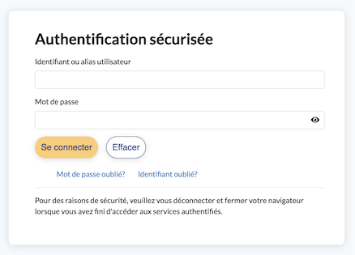
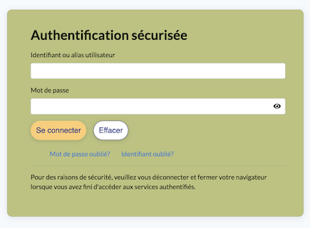
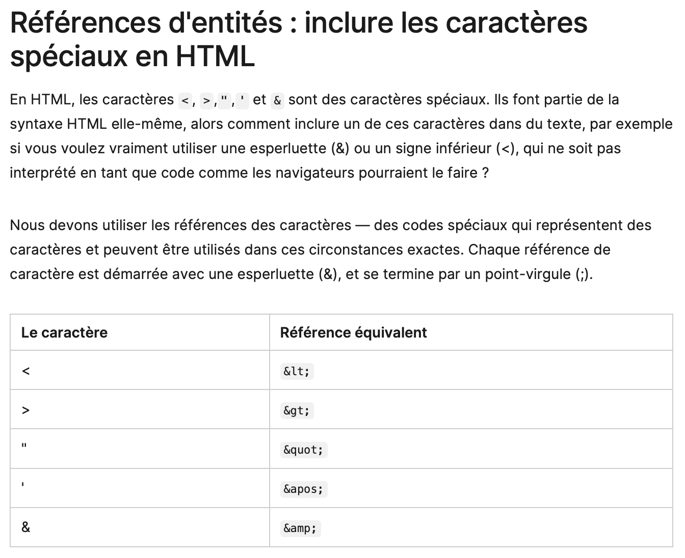

# Chapitre 1: Pages web statiques
{{ initexo(0)}}

{: .center}


{: .center}


## Le cas le plus simple : la même page web pour tout le monde

{: .center}

Nous allons tout d'abord considérer le cas où le serveur renvoie une page unique, identique pour tous les utilisateurs. De plus, l'utilisateur ne pourra pas agir sur sa page : il n'y a aucune interactivité. On parle de page statique.

Exemple de page statique côté serveur et côté utilisateur :

- cette [merveille](./interesting.html){:target="_blank"} de page web.
- plus complète, mais tout aussi statique : cette page [Wikipedia](https://fr.wikipedia.org/wiki/Leslie_Lamport){:target="_blank"} consacrée à Leslie Lamport.

## 1 Pages web en ```html```  pur

Lorsque le client demande au serveur le contenu d'une page web, celui-ci lui renvoie, dans le cas le plus simple, une simple page ```html```.  
```html``` est un langage dit « à balises ».  Ce n'est pas à proprement parler un langage de programmation, mais plutôt un **langage de description** de contenu. 
Il a été inventé en 1992 par [Tim Berners-Lee](https://fr.wikipedia.org/wiki/Tim_Berners-Lee){:target="_blank"}. La version actuellement utilisée est le ```html5```.


!!! abstract "Exemple de page web minimale"
    ```html
    <!DOCTYPE html>
    <html lang='fr'>
      <head>
        <meta charset="utf-8">
        <title>Un titre très original</title>
      </head>
    
      <body>
        <p>Ceci est le texte introductif de ma page.</p>
        <h1>  Ceci est un titre de niveau 1 </h1>
        Mais sans rien d'intéressant.
        <h2>  Ceci est un titre de niveau 2 </h2>
        <ul>
          <li> le début d'une liste indentée </li>
          <li> la suite ... </li>
        </ul>  
        <p>
          Pour apprendre le fonctionnement des balises, voir <a href="https://developer.mozilla.org/fr/docs/Apprendre/HTML/Introduction_%C3%A0_HTML/Getting_started"> ici</a> par exemple !
        </p>
      </body>
    </html>
    
    ```

Allez contempler [ici](./web_minimale.html){:target="_blank"} le rendu de cette magnifique page et **suivez le lien qui s'y trouve pour apprendre le fonctionnement des balises html**.


!!! example "{{ exercice() }}"
    === "Énoncé"
        1. Lire [la page d'introduction à HTML de mozilla](https://developer.mozilla.org/fr/docs/Learn/HTML/Introduction_to_HTML/Getting_started){:target="_blank"} et réaliser les exercices d'apprentissage actif qui s'y trouvent.
        2. Création d'une page personnelle
            - Puis créer un dossier contenant un fichier ```mapage.html``` ainsi qu'un fichier `page2.html`.
            - Créer une page contenant **une image** et un **lien vers le site du lycée** et **un lien vers une autre page**.
        3. Indications:
            - Vous pouvez utiliser l'éditeur de votre choix. Par exemple le logiciel _Sublime Text_  installé au lycée (pour le lancer cliquez sur l'icône Windows puis commencez à taper _Sublime_ au clavier) que vous pouvez aussi [installer](https://www.sublimetext.com){:target="_blank"} sur votre ordinateur personnel.
            - Vous pouvez aussi utiliser un éditeur en ligne avec rendu instantané, du type [https://www.w3schools.com/tryit/](https://www.w3schools.com/tryit/){:target="_blank"}
    === "Canevas"{# #}
        ```html
        	<!DOCTYPE html>
         	<html lang='fr'>
               <head>
       	        <meta charset="utf-8">
        	        <title>Ma première page</title>
               </head>
           	
               <body>
               	
               </body>
           </html>    
        ```
    === "Correction"{# #}  
        - Capytale: 087b-5379747
 
      
### Premières conclusions sur l'utilisation du ```html```

!!! done "À retenir"

    - Pour créer une page web, on crée un fichier ayant l'extension  `.html`  , qui pourra être ouvert dans le navigateur web simplement en faisant un double-clic dessus.
    - Chaque fichier HTML est constitué de balises.
    - Les balises peuvent avoir plusieurs formes :
        - `<balise> </balise>`  : **balises en paires**, elles s'ouvrent et se ferment pour délimiter le contenu (début et fin d'un titre, par exemple) ;
        - `<balise>`  : **balises orphelines** (on ne les insère qu'en un seul exemplaire), elles permettent d'insérer un élément à un endroit précis (par exemple une image).
    - Les balises sont parfois accompagnées d'attributs pour donner des indications supplémentaires, ou paramétrer un élément (exemple :  ``  ).
    - Une page web est constituée de deux sections principales : l'en-tête`<head> </head>`  dont le contenu n'apparaît pas dans l'affichage de la page et le corps `<body> </body>`  qui, lui, apparaît.

### En savoir plus

- [le cours d'OpenClassrooms](https://openclassrooms.com/fr/courses/1603881-apprenez-a-creer-votre-site-web-avec-html5-et-css3){:target="_blank"} (l'inscription est gratuite)
- Le cours interactif sur le HTML [du site w3schools](https://www.w3schools.com/html/){:target="_blank"}


###  Aide mémoire HTML

??? done "Si vous avez besoin de retrouver facilement une balise html"
    Vous pouvez télécharger et consulter 
    [la liste des balises html](./data/Glossaire+des+balises+HTML.pdf){:target="_blank"} de [Mathieu Nebra](https://fr.wikipedia.org/wiki/Mathieu_Nebra){:target="_blank"}.
    

### Quiz

- [Maîtriser les bases de HTML5](https://openclassrooms.com/fr/courses/1603881-creez-votre-sitee-web-avec-html5-et-css3/exercises/4740){:target="_blank"}


## 2 Pages utilisant le ```html``` et le  ```css``` 

L'acronyme ```css```  signifie _Cascading Style Sheets_ (feuilles de style en cascade). L'idée est de regrouper dans un seul fichier toutes les informations relatives à la mise en forme des éléments de la page html. 
De manière très simplifiée, on peut dire que le fichier ```html``` s'occupe _du fond_ tandis que le fichier ```css``` s'occupe de la _forme_.

Le fichier ```css``` (souvent nommé ```style.css```) doit être référencé au début du fichier ```html``` , au sein de la balise ```<head>```.


!!! abstract "Exemple de couple ```html``` / ```css``` minimal"

    - fichier ```index.html``` : 
    ```html
    <!DOCTYPE html>
    <html>
      <head>
        <meta charset="utf-8">
        <title>page test</title>
        <link href="style.css" rel="stylesheet" type="text/css" />
      </head>
        <body>
              <h1>  Ceci est un titre de niveau 1 </h1>
              Mais sans rien d'intéressant.
              <h2>  Ceci est un titre de niveau 2 </h2>
        </body>
    </html>
    ```

    - fichier ```style.css``` :

    ```css
    html {
        font-size: 15px;
        font-family:  sans-serif;
        background-color: lightgray; 
      }

    h1 {
      color: red;
    }
    ```

Pour contempler le nouveau rendu de cette magnifique page vous pouvez vous rendre sur Capytale (code 5b2f-1072956).


!!! example "{{ exercice() }}"
    Reprenez votre page de l'exercice 1 (la page contenant une image et un lien vers le site du lycée) et rajoutez une feuille de style.

!!! example "{{ exercice() }}"
    === "Énoncé"
        - Allez sur la page de connexion à Atrium et affichez l'inspecteur d'élement de votre navigateur (généralement accessible en appuyant sur ```F12``` )
        {: .center}
        - Modifiez le fond du cadre de login à l'aide des attributs de style de la page.
        {: .center}
    
    === "Correction"
        - Clic droit puis «Inspecter l'élément»
        - ```<div class=​"portlet-content" style=​"background-color:​rgb(174,185,104)​">​```
    

!!! example "{{ exercice() }}"
    === "Énoncé"
        - Apprenez à [ajouter des tableaux](https://openclassrooms.com/fr/courses/1603881-creez-votre-site-web-avec-html5-et-css3/8061455-ajoutez-des-tableaux){:target="_blank"} et à les mettre en forme en CSS.
        - Utilisez la balise `<code> </code>` pour représenter un court fragment de code machine.
	    - Utilisez `Alt+0151` pour un tiret long sous Windows.  
        - Créez un fichier `tableau.html`et un fichier `style.css ` afin de recréer la page de l'onglet suivant qui explique comment inclure des caractères spéciaux en HTML. Ne pas oublier de mettre en forme les bordures du tableau grâce à la feuille de style.
        - Publiez ce travail sur Capytale (Exercice4 HTML code 5dba-2681064)

    === "Page à recréer"
        __Voici une capture d'image de la page que vous devez recréer en HTML et CSS:__
        
    === "Correction"
    {{ correction(True,
    "
        ```html linenums='1'
            <h1>Références d'entités : inclure les caractères spéciaux en HTML</h1>
                <p>
                En HTML, les caractères 
                <code>&lt;</code>
                , 
                <code>&gt;</code>
                ,
                <code>&quot;</code>
                ,
                <code>&apos;</code>
                 et 
                <code>&amp;</code>
                sont des caractères spéciaux. Ils font partie de la syntaxe HTML elle-même, alors
                comment inclure un de ces caractères dans du texte, par exemple si vous voulez vraiment
                utiliser une esperluette (&amp;) ou un signe inférieur (&lt;), qui ne soit pas
                interprété en tant que code comme les navigateurs pourraient le faire ?
                </p>
                <p>Nous devons utiliser les références des caractères — des codes spéciaux qui
                représentent des caractères et peuvent être utilisés dans ces circonstances exactes.
                Chaque référence de caractère est démarrée avec une esperluette (&amp;), et se termine
                par un point-virgule (;).</p>
                    <table>
                        <thead>
                            <tr>
                                <th>Le caractère</th>
                                <th>Référence équivalent</th>
                            </tr>
                        </thead>
                        <tbody>
                            <tr>
                                <td>&lt;</td>
                                <td>
                                    <code>&amp;lt;</code>
                                </td>
                            </tr>
                            <tr>
                                <td>&gt;</td>
                                <td>
                                    <code>&amp;gt;</code>
                                </td>
                            </tr>
                            <tr>
                                <td>&quot;</td>
                                <td>
                                    <code>&amp;quot;</code>
                                </td>
                            </tr>
                            <tr>
                                <td>&apos;</td>
                                <td>
                                    <code>&amp;apos;</code>
                                </td>
                            </tr>
                            <tr>
                                <td>&amp;</td>
                                <td>
                                    <code>&amp;amp;</code>
                                </td>
                            </tr>
                        </tbody>
                    </table>
        ```
        ```{.css}
        table {
            border-collapse: collapse;
        }
        td, th {
            border: 1px solid black;
            padding: 15px;
        }
        ```
        "
        ) }}

        

### Premières conclusions sur l'utilisation conjointe du ```html``` et du ```css```

!!! done "À retenir"
    - CSS est un autre langage qui vient compléter le HTML. Son rôle est de mettre en forme votre page web.
    - Pour écrire le code CSS, on crée un fichier séparé portant l'extension `.css`  comme `style.css`.
    - Pour lier les fichiers CSS et HTML, on rajoute une ligne dans la balise `<head> </head>` du fichier HTML :  `<link href="style.css" rel="stylesheet">`
    - En CSS, on sélectionne les portions de la page HTML qu'on veut modifier, et on change leur présentation avec des propriétés CSS :
    ```{.css}
    balise1
    {
        propriete1: valeur1;
        propriete2: valeur2;
    }
    ```
    - Il existe plusieurs façons de sélectionner la portion de page que l'on veut mettre en forme. Par exemple, on peut viser :
        - toutes les balises d'un même type, en écrivant simplement leur nom (`h1`par exemple) ;
        - certaines balises spécifiques, auxquelles on a donné des noms à l'aide des attributs `class` (css: `.nom-classe{}`) ou `id`(css: `#nom-id{}`) ;
        - uniquement les balises qui se trouvent à l'intérieur d'autres balises (`h3`,`em`).

###  Aide mémoire CSS

??? done "Si vous avez besoin de retrouver facilement  une propriété css"
    Vous pouvez télécharger et consulter [la liste des propriétés css](./data/Glossaire+des+proprietes+CSS.pdf){:target="_blank"} de [Mathieu Nebra](https://fr.wikipedia.org/wiki/Mathieu_Nebra){:target="_blank"}.

### En savoir plus

- [le cours d'OpenClassrooms](https://openclassrooms.com/fr/courses/1603881-creez-votre-site-web-avec-html5-et-css3/8061278-integrez-le-css-dans-la-page-html){:target="_blank"} (l'inscription est gratuite)
- le cours interactif sur le CSS [du site w3schools](https://www.w3schools.com/css/default.asp){:target="_blank"}


!!! example "{{ exercice() }}"
    Réalisation d'une page web personnelle
    === "Énoncé"
        - Pour la forme: pour le contenu, écrire un fichier 'html' (ou mieux plusieurs fichiers `html` liés entre eux) sans mettre d'accents pour le nom des fichiers)  et un fichier avec un nom du type `style_prenom.css` pour le style (remplacer `prenom` par votre prénom sans accents). __Utiliser un maximum des balises `html` et des propriétés `css` citées dans les deux aide-mémoires ci-dessus (aide-mémoires que je vous demanderai d'imprimer et d'amener en cours).__ À utiliser impérativement: `class`, `id`, `div` et `span`. 
        - Pour le fond: présentez-vous, présentez vos parents, les études que vous souhaitez faire et par la suite le métier que vous souhaitez exercer. Présentez aussi votre œuvre culturelle préférée  (livre, film, tableau, musique...), en expliquant pourquoi elle vous a marqué. Faites-nous part de votre animal totem (celui qui correspond le mieux à votre caractère ou à votre sensibilité) en expliquant votre choix. Ajoutez d'autres pages si vous le souhaitez (du moment qu'elles sont personnelles). Terminez par une page  où vous indiquerez, sous forme de tableau, les balises `html` que vous avez utilisées (vous en donnerez aussi l'utilité) et vous ferez de même pour les  styles `css` que vous avez utilisés.
        - Publiez ce travail sur Capytale (Exercice5 HTML code 2808-2730306). 
