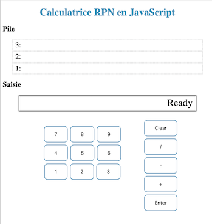
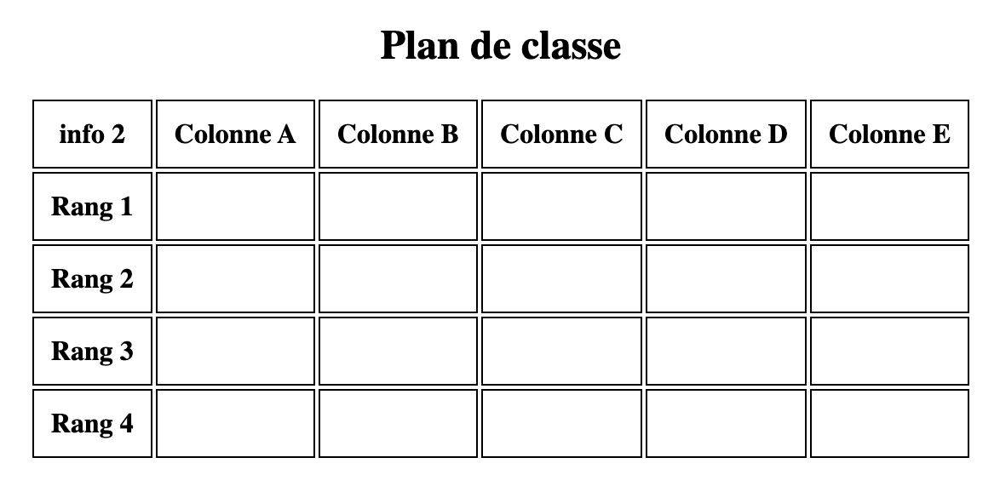

# Chapitre 2: Pages web dynamiques
{{ initexo(0)}}

{: .center}


{: .center}


## 1. Quand le client peut agir sur sa page (exemple avec JavaScript)
{: .center}

Jusqu'à présent, la page web envoyée par le serveur est :

1. identique quel que soit le client.
2. statique après réception sur l'ordinateur du client.

Le JavaScript va venir régler le problème n°2 : il est possible de fabriquer une page sur laquelle le client va pouvoir agir **localement**, sans avoir à redemander une nouvelle page au serveur.

Inventé en 1995 par [Brendan Eich](https://fr.wikipedia.org/wiki/Brendan_Eich){:target="_blank"} pour le navigateur Netscape, le langage JavaScript s'est imposé comme la norme auprès de tous les navigateurs pour apporter de l'interactivité aux pages web.

!!! abstract "Exemple de couple ```html``` / ```JavaScript``` minimal"
    Notre fichier ```index.html``` fait référence, au sein d'une balise ```<script>```, à un fichier externe ```script.js``` qui contiendra notre code JavaScript.   

    - fichier ```index.html``` : 
    ```html
    <!DOCTYPE html>
    <html>
      <head>
        <meta charset="utf-8">
        <title>un peu d'action</title>
        <link href="style.css" rel="stylesheet" type="text/css" />
        <script src="script.js" defer></script>
      </head>
      <body>
        <h1>Une page web extrêmement dynamique</h1>

        <div>

            <label>Changez la couleur d'arrière-plan:</label>

            <button type="button" onclick="choix('yellow');">jaune</button>

            <button type="button" onclick="choix('green');">vert</button>

            <button type="button" onclick="choix('purple');">violet</button> 
        </div>
        <div>
          <p>
          En JavaScript, le nom de la couleur choisie est :
          </p>
          <p id="resultat"></p>
        </div>
      </body>
    </html>
    ```


    - fichier ```script.js``` :
    ```javascript
    function choix(color){
        document.body.style.background = color;
        document.getElementById("resultat").innerHTML=color;
    }
    ```


Le résultat de cette page peut être consulté sur Capytale (code: 41af-1072993).

**Commentaires**

- Au sein du bouton déclaré par la balise ```button```, l'attribut  ```onclick``` reçoit le nom d'une fonction déclarée à l'intérieur du fichier ```script.js```, ici la fonction ```choix()```.
- Cette fonction nous permet de modifier à la fois l'aspect esthétique de la page (changement de la couleur de background) mais aussi le contenu de cette page, en faisant afficher le nom de la couleur.

La puissance du JavaScript permet de réaliser aujourd'hui des interfaces utilisateurs très complexes au sein d'un navigateur, équivalentes à celles produites par des logiciels externes (pensez à Discord, par ex.). Bien sûr, dans ces cas complexes, le serveur est aussi sollicité pour modifier la page, comme nous le verrons en partie 3.


**En savoir plus**

- [le guide JavaScript de la fondation Mozilla](https://developer.mozilla.org/fr/docs/Web/JavaScript/Guide){:target="_blank"}
- [le cours d'OpenClassrooms sur le JavaScript](https://openclassrooms.com/fr/courses/7696886-apprenez-a-programmer-avec-javascript){:target="_blank"}
- [le site W3 sur le JavaScript](https://www.w3schools.com/js/){:target="_blank"}


!!! example "{{ exercice() }}"
    === "Énoncé"
        - Dans Chrome se rendre sur [le guide JavaScript de la fondation Mozilla](https://developer.mozilla.org/fr/docs/Web/JavaScript/Guide){:target="_blank"}
        - Ouvrir les outils de développement dans Chrome
        - Afficher l'onglet *Console*
        - Afficher une alerte en utilisant la fonction ```alert()```: ```alert("NSI, ça déchire!");``` dans la console 
        - D'après le guide, indiquer à quoi servent `let`, `var`, `const` et `console.log()`
        - Quand doit-on utiliser un point-virgule en JS ?
    === "Correction"    {# exo1 #}
        - Il faut déclarer une variable avec le mot-clé ```let``` en le faisant suivre de son nom: ```let myVariable;```
	    - Une fois une variable déclarée, on peut lui donner une valeur : ```myVariable = "Bob";```
	    - On peut aussi faire les deux opérations sur une même ligne si on le souhaite : ```let myVariable = "Bob";```
 	    - Le mot-clé ```let``` permet de définir des variables au sein d'un bloc et des blocs qu'il contient. ```var``` permet quant à lui de définir une variable dont la portée est celle de la fonction englobante.
  	    - Il faut déclarer une constante avec le mot-clé ```const```: ```const myConstante = "Marley";```
   	    - Un point-virgule en fin de ligne indique là où se termine l'instruction ; ce n'est impérativement requis que si vous devez séparer des instructions sur une même ligne. Toutefois, certains pensent qu'il est de bonne pratique de les mettre à la fin de chaque instruction. 
{#
    === "exemple avec `let` et  `var`"
	``` javascript
        if (x > y) {
           let gamma = 12.7 + y;
           i = gamma * x;
        }
        
        function varTest() {
          var x = 1;
          if (true) {
              var x = 2; // c'est la même variable !
              console.log(x); // 2
           }
         console.log(x); // 2
        } 
        
        function letTest() {
           let x = 1;
           if (true) {
              let x = 2; // c'est une variable différente
              console.log(x); // 2
           }
          console.log(x); // 1
        }
        ```
#}
        

!!! example "{{ exercice() }}"
    === "Énoncé"
        - Créer:
            + un `<input>` de type `range` permettant de transmette un âge qui sera compris entre 7 ans et 100 ans
            + un bouton permettant d'afficher l'âge de la personne et si la personne est mineure ou majeure
        <div>
        <input type="range" id="age" name="age"
        min="7" max="100">
        </input>
        <label for="age">Age</label>
        </div>
        <button type="button" onclick="majorite(age.value);">Majeur ?</button>
        <p id="majorite"></p>
        - Placer le JavaScript dans un fichier annexe.
    === "Correction" {# exo2 #}
        ```html
        <!DOCTYPE html>
        <html>
          <head>
            <meta charset="utf-8">
            <title>Exercice</title>
            <script src="script.js" defer></script>
          </head>
          <body>
            <h1>Majorité</h1>
            <div>
            <input type="range" id="age" name="age"
                 min="7" max="100">
            <label for="age">Age</label>
             </div>
            // ici la fonction transmet la valeur 
            <button type="button" onclick="majorite(age.value);">Majeur ?</button>
        
            <p id="majorite"></p>
          </body>
        </html>
        ```
        
        ```javascript
        
        function majorite(age){
        const limite=18; //const permet de déclarer une constante
        var message;     //var permet de déclarer une variable globale
        if (age < limite){
 	        message = " Tu es mineur";
        } else {
	    message = " Vous êtes majeur";
        }
        
        message = "âge:" + age + message;
        // affichage dans la console
        console.log(message); 
        // affichage dans une balise html
        document.getElementById("majorite").innerHTML= message;
        }
        
        ```{# fin exo2 #}

!!! example "{{ exercice() }}"
    === "Énoncé"
        - Créer:
            + un `<input>` de type `text` (le type par défaut) permettant de rentrer un nombre que l'on souhaite compris entre 7 et 100
            + un bouton permettant de tester si la donnée est correcte.
        - Inclure le JavaScript dans le fichier html
    === "Correction"{#  #}
        ```html
        <!DOCTYPE html>
        <html>
        <body>
                
        <h1>Validation par fonction JavaScript</h1>
        
        <p>Saisir un nombre compris entre 7 and 100:</p>
        
        <input id="numb">
        // ici la fonction ne transmet pas la valeur
        <button type="button" onclick="myFunction()">Valider</button>
        
        <p id="demo"></p>
        
        <script>
        function myFunction() {
          let x = document.getElementById("numb").value; //autre façon de récupérer la valeur
          let text;
          if (isNaN(x) || x < 7 || x > 100) {
            text = "Entrée non valide";
          } else {
            text = "Entrée valide";
          }
          document.getElementById("demo").innerHTML = text;
        }
        </script>
        
        </body>
        </html> 
        ``` 
        
        

!!! example "{{ exercice() }}"
    - Reprenez votre page créée aux exercices précédents et rajoutez du JavaScript pour la rendre dynamique. Vous êtes libres d'utiliser des inputs de différents types:
        - text (une chaîne de caractères) ;
        - number (un nombre) ;
        - range (une valeur numérique) ;
        - checkbox (une case à cocher) ;
        - radio (un bouton radio) ;
        - button (un bouton)...
    - Rajoutez des [conditions](https://www.w3schools.com/js/js_if_else.asp){:target="_blank"} `if`, `else if`, `else` et utilisez [les opérateurs logiques](https://www.w3schools.com/js/js_comparisons.asp) AND (noté `&&` en JS) et OR (noté `||` en JS). 


!!! example "{{ exercice() }}: Calculatrice RPN"
    === "Énoncé"
        - La HP Prime est une calculatrice graphique programmable à écran tactile couleur du fabricant américain Hewlett-Packard (HP). La calculatrice prend en charge trois logiques d'entrée différentes : la notation algébrique sur une ligne, une notation similaire à la notation mathématique sur papier, appelée notation Textbook par HP, et la notation polonaise inversée (RPN).
        - [La notation polonaise inverse](https://fr.wikipedia.org/wiki/Notation_polonaise_inverse){:target="_blank"} permet de faire des calculs arithmétiques sans utiliser de parenthèses et sans faire référence à une quelconque adresse mémoire, les données étant stockées dans une pile (les piles seront étudiées de façon détaillée en classe de terminale).
        - Un émulateur de la HP Prime est officiellement disponible pour divers systèmes d’exploitation: Android (Google Play), iOS (Apple App Store) et MS Windows (Microsoft Store). Il existe également une version MacOS et une version Linux.
        - Les [Flex Box CSS](https://www.w3schools.com/css/css3_flexbox.asp){:target="_blank"} sont un standard CSS3 de disposition des éléments dans une page web. Ce standard permet d'avoir un design adaptatif à l'écran. Les éléments peuvent être réagencés selon la taille de l'écran.
        - Les onglets suivants contiennent  l'ébauche du code implémentant une calculatrice RPN. Compléter le code pour avoir une calculatrice entièrement fonctionnelle.
    === "Aperçu"
        {: .center}
    === "index.html"
         ``` html
         <!DOCTYPE html>
         <html lang="fr">
         <head>
           <meta charset="UTF-8">
           <meta http-equiv="X-UA-Compatible" content="IE=edge">
           <meta name="viewport" content="width=device-width, initial-scale=1.0">
           <link rel="stylesheet" href="style.css">
           <script src="calculatrice.js" defer> </script>
           <title>Calculatrice RPN</title>
         </head>
         <body>
           <h1>Calculatrice RPN en JavaScript</h1>
           <h2>Pile</h2>
           <div class="pile">  
           3:<span id="pile3"></span>
           </div> 
           <div class="pile">  
           2:<span id="pile2"></span>
           </div> 
           <div class="pile">  
           1:<span id="pile1"></span>
           </div> 
           <h2>Saisie</h2>
           <div class="centrer">
           <p id="tampon">Ready</p>
           </div>
           <div class="centrer">
           <div class="nombres">
           <div class="ligne">
             <button type="button" onclick="nombre(7)"   class="touche">7</button>
             <button type="button" onclick="nombre(8)"   class="touche">8</button>
             <button type="button" onclick="nombre(9)"   class="touche">9</button>
             </div>
           <div class="ligne">     
             <button type="button" onclick="nombre(4)"  class="touche">4</button>
             <button type="button" onclick="nombre(5)"  class="touche">5</button>
             <button type="button" onclick="nombre(6)"  class="touche">6</button>
           </div>
             <div class="ligne">     
             <button type="button" onclick="nombre(1)"  class="touche">1</button>
             <button type="button" onclick="nombre(2)"  class="touche">2</button>
             <button type="button" onclick="nombre(3)"  class="touche">3</button>
           </div>
           </div>
           <div class="operations">
             <button type="button" onclick="clearAll()" class="touche">Clear</button>
             <button type="button" onclick="division()" class="touche">/</button>
             <button type="button" onclick="soustraction()" class="touche">-</button>
             <button type="button" onclick="addition()" class="touche">+</button>
             <button type="button" onclick="enter()" class="touche">Enter</button>
           </div>
           </div>
         </body>
         </html>
         ```
    === "style.css"
         ```css
         h1 {
           color: #008CBA;
           text-align: center;
         }

         .pile {
           display:flex;
           justify-content:space-between;
           margin:  2px 30px 2px 30px;
           font-size: x-large;
           padding: 4px 10px;
           border: 0.1pt dashed;
         }

         .centrer {
           display:flex;
           justify-content: center;
         }

         #tampon {
           font-size:xx-large;
           border: 2px solid;
           padding: 4px 10px;
           margin: 2px 30px 0px 30px;
           font-family: "Lucida Console";
           width:550px;
           min-height:40px;
           text-align:right;
         }

         .touche {
           font-size:x-large;
           padding: 15px 32px;
           font-size: 16px;
           margin: 4px;
           cursor: pointer;
           background-color: white; 
           color: black; 
           border: 2px solid #008CBA; 
           border-radius:10px;
         }

         .nombres {
           border:solid;
           border-radius: 15px;
           border-color: white;
           max-width:300px; /* largeur du clavier numérique */
           padding:20px;
           background-color: white;
           margin: 20px; 
         }

         .ligne {
           display: flex; /* pour positionner les touches */
           justify-content: center; /* centrées sur la ligne */
           background-color: white;
           }

         .operations {
           display: flex; /* pour positionner les touches d'opérations */
           flex-direction: column; /* en une colonne */
           border:solid;
           border-radius: 15px;
           border-color: white;
           max-width:200px;
           padding:20px;
           background-color: white;
         }
         ```
    === "calculatrice.js"         
         ```javascript
         let pile3  = "";
         let pile2  = "";
         let pile1  = "";
         let tampon = "";

         function nombre(x) {
           tampon = 10*tampon + x;
           document.getElementById("tampon").innerHTML = tampon; 
         };

         function clearAll() { // attention clear() est un mot réservé 
           pile3 = "";
           pile2 = "";
           pile1 = "";
           tampon = "";
           affichage();
         };

         function enter() {
           pile3 = pile2;
           pile2 = pile1;
           if (tampon !="") {
             pile1 = tampon;
             tampon = ""
           }
           affichage();
         };

         function addition() {
           if (tampon!="") {enter()};  
           pile1 = Number(pile2) + Number(pile1);
           pile2 = pile3;
           pile3 = "";
           tampon = "";
           affichage();
         };

         function division() {
           if (tampon!="") {enter()};  
           pile1 = Number(pile2) / Number(pile1);
           pile2 = pile3;
           pile3 = "";
           tampon = "";
           affichage();
         };

         function affichage() {
           document.getElementById("pile3").innerHTML = pile3;
           document.getElementById("pile2").innerHTML = pile2;
           document.getElementById("pile1").innerHTML = pile1;
           document.getElementById("tampon").innerHTML = tampon;
         };

         ```
    === "Correction"
        {{ correction(False,"- Capytale (code 9bcf-2789938)") }}
    
    

## 2. Quand la page est fabriquée à la demande par le serveur


{: .center}

Rappelons que toutes les pages que nous avons créées jusqu'à présent sont uniformément envoyées par le serveur au client. Aucune «préparation» de la page en amont n'a lieu sur le serveur, aucun dialogue n'a lieu avec le serveur une fois que la page a été livrée. 
Évidemment, si le web était comme ceci, il ne serait qu'une gigantesque bibliothèque en consultation seule (ce fut le cas pendant longtemps, et ce qui n'était déjà pas si mal).

Les langages serveurs, parmi lesquels PHP (présent sur environ 80% des serveurs), Python (via les frameworks Django, Jinja2, Flask...), Java, Ruby, C#, permettent de rajouter de l'interactivité côté serveur.

!!! abstract "Exemple de serveur qui se contente de lire des formulaires"
    - Langage: Dans ce TP, nous utilisons le langage Python via la bibliothèque `jinja2`. 
    - Placer les fichiers suivants dans un même dossier:
        - Le fichier [`serveur.py`](./serveur.py) (ce nom devra être conservé) sera à utiliser tel quel. Nous n'aurons pas à le modifier (sauf si l'on désire changer le port). **Il ne devra pas être exécuté**, mais il **devra être présent** au côté des autres fichiers.
        - Les fichiers qu'il faudra modifier sont les fichiers:
            - `dynserveur.py` (ce nom peut être changé) qui contient le code que l'on souhaite voir exécuter sur le serveur. Ce fichier devra être exécuté dans Spyder. 
            - `formulaire1.html` (ce nom peut être changé) qui contient un formulaire (voir page 202 du livre) permettant d'envoyer des données sous forme de dictionnaire au serveur. 
    === "dynserveur.py"
    ```python
    from serveur import get_template, render, OK, Redirect, pageDynamique, lancerServeur
    
    def traitement1(url, vars):
        """Traitement du formulaire1"""
        print("Le formulaire à envoyé:",vars)
        return Redirect('/formulaire1.html')
    
    pageDynamique('/traitement_formulaire1', traitement1)

    # Lancer le serveur
    lancerServeur()
    ```
    === "formulaire1.html"
        - À l'exécution du script `dynserveur.py` dans Spyder, le serveur devrait se lancer et un message devrait vous dire sur quel port (habituellement sur le port 8000). 
        - Se rendre ensuite à l'adresse suivante `http://127.0.0.1:8000` ou tout simplement `127.0.0.1:8000` ou `localhost:8000`. 
        - Les fichiers présents dans votre dossier doivent aparaitre dans votre navigateur internet.
        - À partir de là vous pouvez ouvrir `formulaire1.html`
        - Vérifiez que tout fonctionne et que les données sont bien envoyées sous forme de dictionnaire.
    ```html
    <html>
      <head>
        <meta charset="utf-8">
        <title>Formulaire de base</title>
      </head>
      <body>
        <h1>Formulaire de base</h1>
        <form action="/traitement_formulaire1" method="POST">
          <label>Message : <input type="text" name="msg"></label><br>
          <input name="age" type="number" value="42" min="0" max="100"/><br>
          <input name="regle" type="range" value="60"/><br>
          <input type="submit" value="Envoyer">
        </form>
      </body>
    </html>
    ```

!!! done "À retenir"
    - Une page web peut contenir plusieurs formulaires.
    - Un formulaire peut contenir plusieurs `<input>` dont obligatoirement un `<input>` de type `sumit` pour soumettre le formulaire.
    - Lors de la soumission d'un formulaire, c'est-à-dire lorsque l’on clique le bouton «Envoyer», le navigateur communique deux éléments au serveur:
        - une URL spécifiée grâce à l'attribut `action` du formulaire (dans l'exemple ci-dessus, l'url `"/traitement_formulaire1"` est une [URL relative](https://developer.mozilla.org/en-US/docs/Learn/Common_questions/What_is_a_URL){:target="_blank"} où `/` correspond au dossier racine) ;
        - un dictionnaire qui contient les valeurs saisies dans le formulaire.
    - À la réception de ces éléments, le serveur:
        - se sert de l'URL pour faire le lien avec une fonction (grâce à `pageDynamique`) ;
        - effectue un traitement des données dans la fonction ;
        - renvoie une page au navigateur.
    


!!! example "{{ exercice() }}: Un service Web (activité pages 196-197 du manuel)"
    - Télécharger le programme `serveur.py` (un lien est donné en haut de la page 196) ainsi que les autres fichiers fournis.
    - Résumé de ce qu'il faut faire pour lancer le serveur (une fois que les fichiers sont bien complétés conformément à ce qui est demandé dans l'activité): ouvrir fichier `dynserveur.py` dans Spyder pour l'exécuter pour démarrer le serveur (il ne faudra jamais modifier le fichier `serveur.py` par contre les autres fichiers pourront si besoin être modifiés). Ouvrir `localhost:8000` dans un navigateur.
        

!!! done "Utiliser un template pour générer une page HTML"
    - Jinja2 est ce que l’on appelle un moteur de templates (patrons en français…). L'intérêt de Jinja2 est qu’il est écrit en Python et très fortement intégré à ce langage. 

    - Les moteurs de templates fonctionnent quasiment tous de la même manière : à partir d’un patron (template), on effectue le rendu en transmettant un contexte.

    - Un patron est constitué de parties fixes et de parties variables ; Jinja2 fournit même des boucles et des tests. Il est ainsi possible de générer différentes sorties avec un même patron en fonction du contexte.
    
!!! example "{{ exercice() }}"
    ??? "exercice 17 page 212: Boite à secrets (requette POST)"
        === "Quelques indications supplémentaires"
            - Télécharger les 2 fichiers qui sont fournis avec l’exercice.
            - Les renommer `serveur.py` et `secret.py`
            - Dans le fichier `secret.py` rechercher l'instruction `Pagedynamique` pour déterminer le nom de l'action qu'il faudra utiliser dans le formulaire.
            - Créer un fichier secret.html contenant un formulaire avec notamment: 
                - une zone de saisie de type `text` pour le nom ;
                - une zone de saisie de type `password` pour le mot de passe ;
                - une zone de saisie de type `text` pour le secret ;
                - un bouton pour envoyer le formulaire.
            - Dans le fichier `secret.py` rechercher le nom des clés utilisées par le dictionnaire `secrets` pour déterminer l'attribut `name` des différentes zones de saisie.
            - Dans ce même fichier html, rajouter le code jinja2 pour permettre d'afficher l'ancien message secret envoyé par le serveur. 
        === "Correction `secret.html`"
        {{ correction(False,
        "
        
            ```html
            <html> 
              <head>
                <meta charset='utf-8'>
                <title>Boite à secrets est une page dynamique</title>
              </head>
            
              <body>
                <h1>Boîte à secrets</h1>
                <form action='/secret' method='POST'>
                  Nom :                  <input type='text'     name='nom'>        <br>
                  Mot de passe :         <input type='password' name='motdepasse'> <br>
                  Secret à enregistrer : <input type='text'     name='secret'>     <br><br>
                                         <input type='submit'   value='Valider'>
                </form>
                <hr>
                <p>{{message}}</p>
              </body>
            </html>
            ```
            "
                ) }}
            
        === "Correction `secret.py`"
        {{ correction(False,
        "
            ```python 
            from serveur import get_template, render, OK, pageDynamique, lancerServeur
            import requests
            
            # dictionnaire des secrets : la clé est le nom,
            #                            la valeur est un tuple (mot de passe, secret)
            secrets = {}
    
            
            def secret(url, vars):
                print('Fonction secret appelée')
                print(vars)
                # extraire les valeurs du formulaire
                # vars est un dictionaire
                nom = vars['nom']  # valeur pour la clé 'nom'
                motdepasse = vars['motdepasse'] # valeur pour la clé 'motdepasse' 
                secret = vars['secret'] # valeur pour la clé 'secret'
                msg = ''
                if nom not in secrets:
                    # créer un nouveau secret pour ce nom 
                    secrets[nom] = (motdepasse, secret) 
                    msg = 'Secret enregistré'
                else:
                    # récuperer le contenu du secret
                    (mdp, s) = secrets[nom]
                    # vérifier si le mot de passe est corret
                    if mdp != motdepasse:
                        msg = 'mot de passe incorrect !'
                    else:
                        # révéler l'ancien secret (si vide) 
                        if secret == '':
                            msg = 'ancien secret : ' + s
                        else:
                        # enregistrer le nouveau secret (si non vide)
                            secrets[nom] = (motdepasse, secret) # écrase l'ancien secret
                # retourner la page avec le message
                template = get_template('secret.html')
                return OK(render(template, {'message': msg}))
    
    
            def affichage_initial(url, vars):
                # Affiche la page secret.html avec {{ message }} = ''
                template = get_template('secret.html')
                msg = ''
                return OK(render(template, {'message': msg}))
            
            pageDynamique('/secret', secret) # appel par submit du formulaire
            pageDynamique('/secret.html', affichage_initial) # ouverture initiale de la page
            
            lancerServeur()
            
            
            ```
            "
            ) }}

!!! example "{{ exercice() }}"
    ??? "Plan de classe"
        === "Énoncé"
            ??? "Ressources autorisées:"
                - Ce cours
                - Votre manuel sur Correlyce
                - Vous avez également le droit de consulter les différents fichiers que vous avez déjà utilisés dans le cadre des exemples et exercices du cours.
            1. Créer un fichier `formulaire.html` contenant le code permettant d'afficher le plan de classe vierge suivant:
               {: .center}
               Utiliser le style `css` suivant pour la mise en forme:
               ```{.css}
               html{
                   font-size: 1em;
               }
               h1{
                   font-size: 1.5em;
                   text-align: center;
               }
               table{
                   margin-left: auto; 
                   margin-right: auto;
               }
               th, td {
                   border: 1px solid black;
                   padding: 10px;
               }
               ```
            2. Rajouter le code nécessaire pour obtenir le formulaire suivant:
               {: .center}
            3. Créer un fichier `dynserveur.py` et ajouter un patron au fichier `formulaire.html` pour remplir les cases du plan de classe au fur et à mesure que des places sont attribuées aux élèves. Le code affichera «place libre» dans les cases restant libres. Enregistrer le fichier html modifié sous un nouveau nom: `patron.html`.
        === "Correction"
        {{ correction(False,
        "
            - fichier `formulaire.html`
            ```html
            <html>
              <head>
                <meta charset='utf-8'>
                <title>Formulaire de base</title>
                <link href='style.css' rel='stylesheet' type='text/css' />
              </head>
              <body>
            
            
                <h1>Plan de classe</h1>
            
                <table>
                  <tr>
                    <th>info 2</th>
                    <th>Colonne A</th>
                    <th>Colonne B</th>
                    <th>Colonne C</th>
                    <th>Colonne D</th>
                    <th>Colonne E</th>
                  </tr>
                  <tr>
                    <th>Rang 1</th>
                    <td></td>
                    <td></td>
                    <td></td>
                    <td></td>
                    <td></td>
                  </tr>
                  <tr>
                    <th>Rang 2</th>
                    <td></td>
                    <td></td>
                    <td></td>
                    <td></td>
                    <td></td>
                  </tr>
                  <tr>
                    <th>Rang 3</th>
                    <td></td>
                    <td></td>
                    <td></td>
                    <td></td>
                    <td></td>
                  </tr>
                  <tr>
                    <th>Rang 4</th>
                    <td></td>
                    <td></td>
                    <td></td>
                    <td></td>
                    <td></td>
                  </tr>
                </table>
            
                <h1>Formulaire élève</h1>
                <form action='/eleve' method='POST'>
                  <label for='zone1'>Nom:</label>
                  <input type='text' id='zone1' name='nom'><br/>
                  <label for='zone2'>Prénom:</label>
                  <input type='text' id='zone2' name='prenom'><br/>
                  <p>Colonne:
                    <input type='radio' id='zoneA' name='colonne' value='A'>
                    <label for='zoneA'>A</label>
                    <input type='radio' id='zoneB' name='colonne' value='B'>
                    <label for='zoneB'>B</label>
                    <input type='radio' id='zoneC' name='colonne' value='C'>
                    <label for='zoneC'>C</label>
                    <input type='radio' id='zoneD' name='colonne' value='D'>
                    <label for='zoneD'>D</label>
                    <input type='radio' id='zoneE' name='colonne' value='E'>
                    <label for='zoneE'>E</label><br>
                  </p>
                  <p>
                    <label for='zoneRang'>Rang:</label>
                    <input type='number' id='zoneRang' name='rang' min='1' max='4'>
                  </p>     
                  <input type='submit' value='Envoyer'>
                </form>
              </body>
            </html>
            ```

            - fichier `dynserveur.py`
            ```python 
            from serveur import get_template, render, OK, Redirect, pageDynamique, lancerServeur
           
            # Traitement des données
            # Créer 4 listes nommées rang1, rang2, rang3 et rang4
            # Chaque rang comporte 5 places initialement libres donc
            pl = 'place libre'
            rang1 = [pl, pl, pl, pl, pl]
            rang2 = [pl, pl, pl, pl, pl] 
            rang3 = [pl, pl, pl, pl, pl]
            rang4 = [pl, pl, pl, pl, pl]
            
            def traitement(url, vars):
                '''Traitement du formulaire'''
                # Vérifions la récupération des données par le serveur
                # Pour cela, affichons dans la console python le dictionnaire 
                # envoyé par le formulaire.
                print('Le formulaire à envoyé:',vars)

                # On peut prévoir de contrôler la validité des données transmises 
                colonne_valide, rang_valide, place_disponible = True, True, True

                # Traitement des données
                # Utilisons les 4 listes pour stocker le nom des élèves à l'endroit le
                # plus logique au fur et à mesure de leur réception par le serveur.
                
                # Détermination de l'index de liste suivant la colonne
                if   vars['colonne']=='A': index = 0
                elif vars['colonne']=='B': index = 1
                elif vars['colonne']=='C': index = 2
                elif vars['colonne']=='D': index = 3
                elif vars['colonne']=='E': index = 4
                else: colonne_valide = False
                # remarque: colonne_valide n'est pas exploité mais pourrait l'être 
                if   vars['rang']=='1':
                    if rang1[index]==pl: rang1[index] =  vars['prenom'] + ' ' + vars['nom']
                    else: place_disponible = False
                elif vars['rang']=='2':
                    if rang2[index]==pl: rang2[index] =  vars['prenom'] + ' ' + vars['nom']
                    else: place_disponible = False
                elif   vars['rang']=='3':
                    if rang3[index]==pl: rang3[index] =  vars['prenom'] + ' ' + vars['nom']
                    else: place_disponible = False
                elif   vars['rang']=='4':
                    if rang4[index]==pl: rang4[index] =  vars['prenom'] + ' ' + vars['nom']
                    else: place_disponible = False
                else: rang_valide = False
                # remarque: rang_valide n'est pas exploité mais pourrait l'être

                # On peut prévoir d'afficher une alerte dans la console
                # si un emplacement était déjà occupé
                if not place_disponible:
                    col = vars['colonne']
                    rg  = vars['rang']
                    print(f'Alerte: vérifier la place {col}{rg}')
                
                # Afficher le plan dans la console
                # permet de vérifier que la gestion des 4 listes est correcte
                affiche_plan_dans_console()
                cle = vars['colonne']+vars['rang']
                print(cle)
                
                
                # Si c'est le cas on peut renvoyer les listes vers la page html
                template = get_template('patron.html')
                msg = {'rang1': rang1,
                       'rang2': rang2,
                       'rang3': rang3,
                       'rang4': rang4}
                return OK(render(template, msg))
                
            pageDynamique('/eleve', traitement)
            
            def affiche_plan_dans_console():
                '''
                Affiche le plan de classe dans la console
                étape intermédiaire de vérification
                '''
                print('rang1:', rang1)
                print('rang2:', rang2)
                print('rang3:', rang3)
                print('rang4:', rang4)
            
            # Lancer le serveur
            lancerServeur()
            ```

            - fichier `patron.html`
            ```html
            <html>
              <head>
                <meta charset='utf-8'>
                <title>Formulaire et plan</title>
                <link href='style.css' rel='stylesheet' type='text/css' />
              </head>
              <body>
            
                <h1>Plan de classe</h1>
            
                <table>
                  <tr>
                    <th>info 2</th>
                    <th>Colonne A</th>
                    <th>Colonne B</th>
                    <th>Colonne C</th>
                    <th>Colonne D</th>
                    <th>Colonne E</th>
                  </tr>
                  <tr>
                    <th>Rang 1</th>
                    
                    <td>{{eleve}}</td>
                    
                  </tr>
                  <tr>
                    <th>Rang 2</th>
                    
                    <td>{{eleve}}</td>
                    
                  </tr>
                  <tr>
                    <th>Rang 3</th>
                    
                    <td>{{eleve}}</td>
                    
                  </tr>
                  <tr>
                    <th>Rang 4</th>
                    
                    <td>{{eleve}}</td>
                    
                  </tr>
                </table>
            
                <h1>Formulaire élève</h1>
                <form action='/eleve' method='POST'>
                  <label for='zone1'>Nom:</label>
                  <input type='text' id='zone1' name='nom'><br/>
                  <label for='zone2'>Prénom:</label>
                  <input type='text' id='zone2' name='prenom'><br/>
                  <p>Colonne:
                    <input type='radio' id='zoneA' name='colonne' value='A'>
                    <label for='zoneA'>A</label>
                    <input type='radio' id='zoneB' name='colonne' value='B'>
                    <label for='zoneB'>B</label>
                    <input type='radio' id='zoneC' name='colonne' value='C'>
                    <label for='zoneC'>C</label>
                    <input type='radio' id='zoneD' name='colonne' value='D'>
                    <label for='zoneD'>D</label>
                    <input type='radio' id='zoneE' name='colonne' value='E'>
                    <label for='zoneE'>E</label><br>
                  </p>
                  <p>
                    <label for='zoneRang'>Rang:</label>
                    <input type='number' id='zoneRang' name='rang' min='1' max='4'>
                  </p>
                  <input type='submit' value='Envoyer'>
                </form>
              
              </body>
            </html>
            ```
            
            - Ne pas oublier le fichier `style.css`
            
            - Tous ces fichiers doivent être dans un même dossier qui doit également contenir le fichier `serveur.py`.
            "
            ) }}
