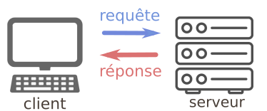

# Chapitre 2: Protocole HTTP  étude du chargement d'une page web

{: .center}

## Le protocole HTTP : des requêtes et des réponses

Le protocole ou environnement **client–serveur** désigne un mode de transaction (souvent à travers un réseau) entre plusieurs programmes ou processus : l'un, qualifié de **client, envoie des requêtes** ; l'autre, qualifié de **serveur, attend les requêtes des clients et y répond.**

Le serveur offre ici un service au client. On parle souvent d'un service pour désigner la fonctionnalité offerte par un processus serveur.

Par extension, le client désigne souvent l'ordinateur sur lequel est exécuté le logiciel client, et le serveur, l'ordinateur sur lequel est exécuté le logiciel serveur. Parfois le client et le serveur peuvent être sur la même machine. En effet un ordinateur unique peut exécuter à la fois un programme serveur et un programme client.

### Exemples d'architecture client-serveur

La consultation de pages sur un site Web fonctionne sur une architecture client–serveur. Un internaute connecté au réseau via son ordinateur et un navigateur Web est le client, le serveur est constitué par le ou les ordinateurs contenant les applications qui fournissent les pages demandées. C'est le protocole de communication HTTP ou XML socket qui est utilisé. Les courriels sont envoyés et reçus par des clients et gérés par un serveur de messagerie. C'est le protocole de communication SMTP, POP ou IMAP qui est utilisé.


!!! done "À retenir"
    HTTP (HyperText Transfer Protocol) est le protocole qui régit la communication entre :

    - le client (la machine de l'utilisateur qui souhaite obtenir une page web). On dit que le client effectue une **requête**.  
    - le serveur (la machine sur laquelle sont stockés les fichiers nécessaires à l'affichage de cette page web). Le serveur va renvoyer une **réponse**.
 

    {: .center}


### Déroulé d'une requête
Prenons pour exemple la requête d'un navigateur vers la page ```http://glassus1.free.fr/interesting.html``` 

- le navigateur analyse l'url : la demande concerne la page ```interesting.html```, stockée sur le serveur ```glassus1.free.fr```.
- une demande est préalablement effectuée auprès pour obtenir l'adresse IP du serveur ```glassus1.free.fr``` (qui est en fait un sous-domaine du serveur des pages personnelles de l'opérateur Free). Ici, l'adresse IP sera ```212.27.63.111``` (on la retrouvera dans la capture de la fenêtre d'Outils de développement).
- la requête est effectuée sur le port 80 de l'adresse ```212.27.63.111```.
- la réponse est envoyée au navigateur, qui en extrait la charge utile et procède à l'affichage de la page.


### Analyse à l'aide d'un navigateur

Observons à partir de l'Inspecteur d'élément d'un navigateur (ici Firefox) les informations qui transitent lors de la requête et de la réponse.

{: .center}

- Point **1** : La requête de type GET vers l'url ```http://glassus1.free.fr/interesting.html``` a généré un code de réponse **200 OK**, ce qui signifie que la requête a été traitée et que la réponse contenant la page a été envoyée.  
Vous pouvez trouver à l'adresse [https://developer.mozilla.org/fr/docs/Web/HTTP/Status](https://developer.mozilla.org/fr/docs/Web/HTTP/Status){. target="_blank"} la totalité des codes de réponse possibles. 
Citons par exemple : 
    - **304 Not Modified** : la page n'a pas eu besoin d'être renvoyée, elle indique au navigateur d'aller la rechercher dans son cache. On peut obtenir ce code de réponse en actualisant la page actuelle ```http://glassus1.free.fr/interesting.fr``` (qui est une page ultra-basique, et n'évolue pas). Pour ré-obtenir un code 200, il faut faire un hard-refresh en appuyant sur Maj pendant l'actualisation.
    - **403 Forbidden** : le client n'a pas le droit d'accès à la page.
    - **404 Not Found** : la page demandée est introuvable
    - **500 Internal Server Error** : le serveur a rencontré une erreur qu'il ne sait pas traiter.

<br>

- Point **2** : en observant la taille totale des données transférées (388 octets), on peut comprendre que la réponse faite par le serveur est constituée :
    - d'un **En-tête** (264 octets) qui contient :
    ```
    HTTP/1.1 200 OK
    Date: Wed, 22 Apr 2020 08:02:01 GMT
    Server: Apache/ProXad [Jan 23 2019 19:58:42]
    Last-Modified: Sun, 12 Apr 2020 16:39:55 GMT
    ETag: "15d7c75-7c-5e93445b"
    Connection: close
    Accept-Ranges: bytes
    Content-Length: 124
    Content-Type: text/html
    ``` 
    - du corps de la **Réponse** (dont on sait d'après l'en-tête qu'il pèse 124 octets). Ce corps de la réponse est la charge utile de la réponse. Elle contient ici le code html de la page :
    ```html
    <!DOCTYPE html>
    <html>
    <head>
    <title>Waouh</title>
    </head>
    <body>
    Ceci est vraiment une jolie page web.
    </body>
    </html>
    ```

**Remarque :** on peut observer que le navigateur a aussi effectué (de sa propre initiative) une requête vers un fichier ```favicon.ico``` qui est l'icone de la page web dans les onglets du navigateur ou la barre de favoris. Ce fichier était bien présent sur le serveur (ce n'est pas toujours le cas), il a donc été envoyé dans la réponse du serveur. 

De manière générale, une requête vers un site web moins élémentaire va occasionner une multitude de réponses.

Par exemple, l'appel au site ```www.lyceemauriac.fr``` génère 129 requêtes/réponses différentes, composées de fichiers html, css, js, de fichiers de fontes woff2, d'images jpg, png...


{: .center}


{{ initexo(0)}}
!!! example "{{ exercice() }}"
    === "Énoncé"
        Commencer par étudier le cours suivant: [Eduscol](https://www.atrium-sud.fr/documents/289762108/414457480/RA_Lycee_G_NSI_ihm_interaction_client_serveur_1170771.pdf/ed1392be-cce9-4f0c-bff0-7ba9ea0854a6?version=1.0){:target="_blank"}
    
        1. Qu'est-ce qu'un serveur DNS ?
        2. Expliquez la phrase : « TCP découpe les données en paquets compatibles avec la taille requise pour IP »
        3. Visiter la page [http://eduscol.education.fr](http://eduscol.education.fr){:target="_blank"} dans Chrome
        4. Afficher > Options pour développeurs > Outils de développement
        5. Network
        6. Actualiser la page
        7. Colonne Name:  eduscol.education.fr
        8. Onglet Headers :
            - Vérifier l'adresse IP donnée dans le cours pour eduscol.education.fr ainsi que le port utilisé
            - La méthode utilisée est-elle une méthode GET ou POST ?
            - Quel code nous indique quelle a abouti ? 
            - Comparer Request Headers et Response Headers aux données de la page 2 du cours d'Éduscol.
        9. Onglet Timing :
            - Combien de temps le seveur DNS a-t-il mis pour renvoyer l'adresse IP ?
            - Combien de temps faut-il attendre entre l'envoi de la requête et l'envoie du premier bit (Time To First Bit) de la réponse.
            - Combien de temps a duré la communication ?
            - Combien de temps a nécessité  le téléchargement proporement dit des données ? Calculer le poucentage que cela représente par rapport à la durée totale de la communication client-serveur.
    === "Correction"
