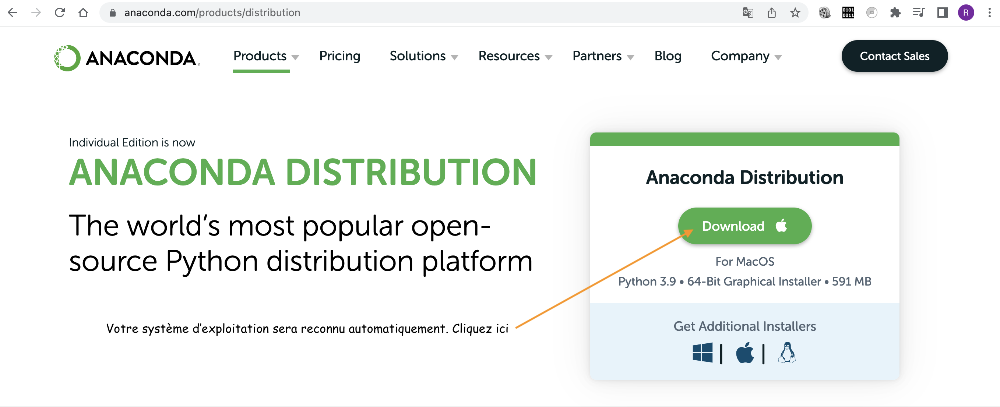

# IDE

Comme pour tous les langages de programmation, il n'existe pas **un** logiciel permettant de coder en Python, mais un très (très) grand nombre de logiciels différents, qu'on regroupe sous le nom d'IDE (interfaces de développement)

## Installer un IDE (par exemple Anaconda)

Au lycée nous utiliserons [Anaconda](https://www.anaconda.com/products/distribution). 

{: .center}

Pour l'installer:

1. Rendez vous sur la page [https://www.anaconda.com/products/distribution](https://www.anaconda.com/products/distribution)

2. Téléchargez et installez la version qui correspond à votre système d'exploitation (Windows, Mac, Linux) en cliquant sur Download.

## Alternatives (par exemple  Thonny)

{: .center}

1. Rendez vous sur la page [https://thonny.org/](https://thonny.org/)

2. Téléchargez et installez la version qui correspond à votre système d'exploitation (Windows, Mac, Linux).

Il y a d'autres alternatives: Pyzo, PyCharm, Spyder, VisualStudioCode... impossible de toutes les citer !

## Solutions en ligne
En ligne, sans aucune installation, vous pouvez utiliser [https://console.basthon.fr/](https://console.basthon.fr/)

ou bien même la console ci-dessous !

{{ terminal() }}

ou l'IDE qui suit :

{{ IDEv() }}
