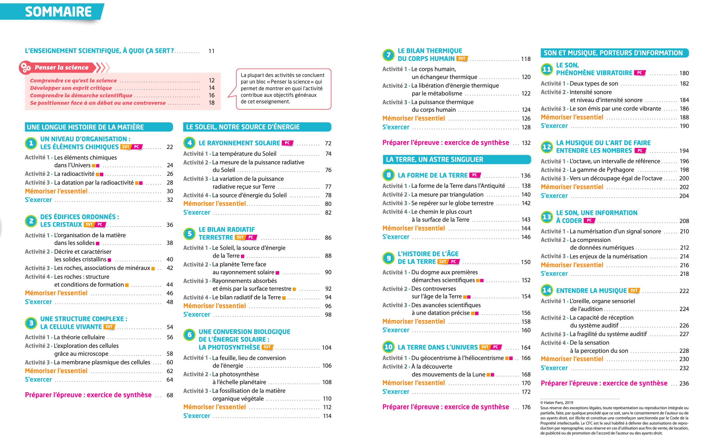

# Projets

## Constitution des équipes

- Des équipes de 2 à 5 élèves en restant entre élèves du même établissement et en faisant en sorte que tous les élèves soient inclus.

!!! success  "Équipes"
    === "Lycée de la méditerranée" 
        | MedA                   | MedB            | MedC                  |
        |:----------------------:|:---------------:|:---------------------:|
        | ARSLAN Roman           | KERCHOUNI Anna  | RAMANGA Nathan        |
        | DI VITO COGNIAT Zoe    | MICHAUD Clément | SUY Heng Tan          |
        | GOMEZ-BARTHEYE Esteban | MOUTON Oscar    | TURCAT Raphael        |
        | GUEGUEN Antoine        | PHILIPPON Leo   | VAN DE ROSIEREN Isaac |
         
    === "Lycée Lumière"
        | LumA           | LumB                    | LumC          |
        |:--------------:|:-----------------------:|:-------------:|
        | MICHEL Mathieu | CHARMASSON Alexandre    | GACHI Naelle  |
        | BOYER Mikael   | DACOSTANEIVA Marcellino | GRANIER Niels |
        |                | DUA Terence             | SINICA Romain |
         
         
         
         
         
         
         
         

## Sujets
- Concernant les sujets, je souhaiterais que les sujets des différents projets soient __inspirés par le contenu du programme d'enseignement scientifique__, car c'est une discipline suivie par tous les élèves et qui donne facilement la possibilité d'en dégager des projets de programmation. De plus, cela devrait garantir un travail original sachant que s'approprier le travail d'autres personnes est interdit.   

??? info "Contenu du programme d'enseignement scientifique (Hatier)"
    {: .center}
    

- Ces projets peuvent être plus ou moins ambitieux suivant votre niveau en programmation: vous pouvez ajouter une interface graphique, un serveur web... 

## Exemple de projet
- Projet réalisé par un élève [https://youtu.be/oLlt0fwXRY4](https://youtu.be/oLlt0fwXRY4). Remarque: Cette année-là, la consigne était de réaliser un projet à partir du programme de la spécialité physique-chimie. 

## Trophés NSI (la participation aux trophés est facultative)

De plus, si vous le souhaitez, vous avez la possibilité de participer aux trophés NSI pour tout type de projets, ambitieux ou modestes.

Renseignez-vous ici: [https://trophees-nsi.fr](https://trophees-nsi.fr)

!!! info "Dossier de candidature aux trophés NSI"

    Le projet et le dossier de candidature sont impérativement réalisés par les élèves.
    
    Le dossier de candidature doit contenir les éléments suivants :
    
    - Le nom du projet.
    
    - La composition de l'équipe : 2 à 5 élèves maximum par équipe et d'un même établissement scolaire. Une autorisation signée, pour l'utilisation de l'image et/ou de la voix et des oeuvres, est obligatoire pour chaque élève inscrit au concours.
    
    - La photo de l'équipe, au format png ou jpeg, 500x500 px.
    
    - Le résumé du projet en 500 caractères maximum. Cette description sera réutilisée pour les communications officielles (réseaux sociaux, valorisation des lauréats).
    
    - La description générale du projet : 4 pages maximum, selon le  [modèle fourni](https://trophees-nsi.fr/documentation).
    
    - Le dossier technique (code source et documentation technique) selon la nomenclature exigée, à héberger sur un espace de stockage en ligne et sécurisé. Il est possible d'utiliser la  [forge GitLab de l'association AEIF](https://forge.aeif.fr/trophees-nsi/) dans le cadre du concours.
    
    - La présentation vidéo (durée : 2 min maximum) incluant une démonstration du projet : la vidéo est à déposer préalablement sur  [Peertube Apps](https://portail.apps.education.fr/signin).
    

