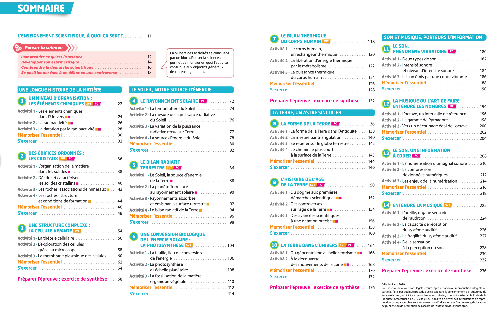

# MedC

## Chapitre à traiter: ?  (chapitre ? )

??? info "Contenu du programme d'enseignement scientifique (Hatier)"
    {: .center}
    

## Constitution de l'équipe et projets

 | MedC                  | Projets |
 |:---------------------:|:-------:|
 | RAMANGA Nathan        |         |
 | SUY Heng Tan          |         |
 | TURCAT Raphael        |         |
 | VAN DE ROSIEREN Isaac |         |

(* porte-parole du groupe)

## Évaluation du travail 

Au travers de la démarche de projet, les compétences à acquérir sont : Analyser, S'organiser, Programmer (Modéliser, Abstraire, Généraliser, Décomposer, Évaluer, Anticiper) et Communiquer.

### Conduite de projet (sur 10 points)

Les notes tiennent compte du respect des délais.

| Critère collectifs               | Observation du groupe MedC   | note | barème |
|:---------------------------------|------------------------------|------|--------|
| Constitution du groupe           | délai dépassé donc attribuée | 0    | /1     |
| Désignation d'un porte-parole    |                              |      | /1     |
| Choix d'un thème (chapitre d'ES) |                              |      | /1     |
| Communication* du groupe         |                              |      | /2     |
| **TOTAL**                        |                              |      |        |

| Critères individuels                                             | Observation de l'élève | note | barème |
|:-----------------------------------------------------------------|------------------------|------|--------|
| Validation du projet individuel                                  |                        |      | /1     |
| Communication* individuelle                                      |                        |      | /2     |
| Implication de l'élève dans sa tâche individuelle                |                        |      | /1     |
| Implication et disponibilité de l'élève dans le projet collectif |                        |      | /1     |
| **TOTAL**                                                        |                        |      |        |

(* fréquence et qualité des échanges avec le professeur, prise en compte des remarques...)

### Code source (sur 5 points)
Au travers du code source qui sera transmis au professeur, les critères d'évaluation sont:

- le respect du cahier des charges ;
- la pertinence de la décomposition de la tâche sous forme de sous-tâches (fonctions, modules, bibliothèques, variables …) ;
- la facilité de lecture du code : existence d'une documentation, de commentaires, de noms explicites pour les variables ;
- la qualité du produit final (clarté, intuitivité, contenu, ergonomie...).

### Présentation du projet (sur 5 points)

- Chaque élève doit être capable d'expliquer comment s'intègre sa tâche dans le projet global et critiquer le résultat obtenu. Une partie du compte-rendu peut être commune à tous les membres de l'équipe et se poursuivre par les présentations individuelles du travail de chacun.

- La présentation donnera lieu à une captation vidéo. Cette vidéo sera évaluée en tant que prestation du projet.
